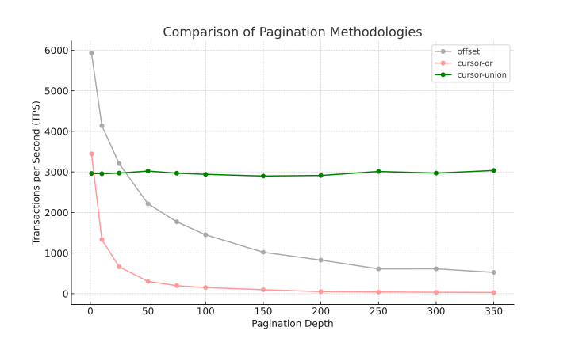

## Offset vs Cursor



```prompt
You are an expert in drawing svg charts based on dataset that are provided in csv format.

Here is a dataset that contains the results from 3 different tests.
each test refer to the same sql file.
the last colum contains TPS (transaction per second)
the second last column contains the X value

title of the chart: Comparison of Pagination Metodologies
title of X axis: pagination depth

the offset should be dark dark gray
the cursor-or a light red
the cursor-union a solid green

create the  chart as svg

sql/sql1/offset.sql,10,10,100,page=1,5930
sql/sql1/offset.sql,10,10,100,page=10,4140
sql/sql1/offset.sql,10,10,100,page=25,3203
sql/sql1/offset.sql,10,10,100,page=50,2214
sql/sql1/offset.sql,10,10,100,page=75,1770
sql/sql1/offset.sql,10,10,100,page=100,1451
sql/sql1/offset.sql,10,10,100,page=150,1020
sql/sql1/offset.sql,10,10,100,page=200,827
sql/sql1/offset.sql,10,10,100,page=250,611
sql/sql1/offset.sql,10,10,100,page=300,612
sql/sql1/offset.sql,10,10,100,page=350,524
sql/sql1/cursor-or.sql,10,10,100,amount=1,3445
sql/sql1/cursor-or.sql,10,10,100,amount=10,1332
sql/sql1/cursor-or.sql,10,10,100,amount=25,661
sql/sql1/cursor-or.sql,10,10,100,amount=50,302
sql/sql1/cursor-or.sql,10,10,100,amount=75,196
sql/sql1/cursor-or.sql,10,10,100,amount=100,151
sql/sql1/cursor-or.sql,10,10,100,amount=150,97
sql/sql1/cursor-or.sql,10,10,100,amount=200,51
sql/sql1/cursor-or.sql,10,10,100,amount=250,42
sql/sql1/cursor-or.sql,10,10,100,amount=300,35
sql/sql1/cursor-or.sql,10,10,100,amount=350,30
sql/sql1/cursor-union.sql,10,10,100,amount=1,2962
sql/sql1/cursor-union.sql,10,10,100,amount=10,2955
sql/sql1/cursor-union.sql,10,10,100,amount=25,2970
sql/sql1/cursor-union.sql,10,10,100,amount=50,3021
sql/sql1/cursor-union.sql,10,10,100,amount=75,2968
sql/sql1/cursor-union.sql,10,10,100,amount=100,2940
sql/sql1/cursor-union.sql,10,10,100,amount=150,2898
sql/sql1/cursor-union.sql,10,10,100,amount=200,2912
sql/sql1/cursor-union.sql,10,10,100,amount=250,3011
sql/sql1/cursor-union.sql,10,10,100,amount=300,2970
sql/sql1/cursor-union.sql,10,10,100,amount=350,3035
```
