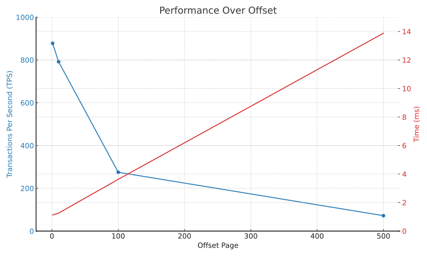
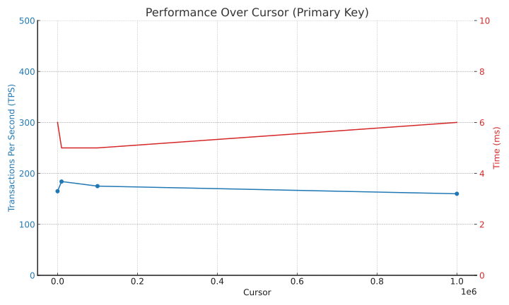
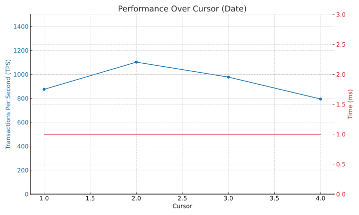
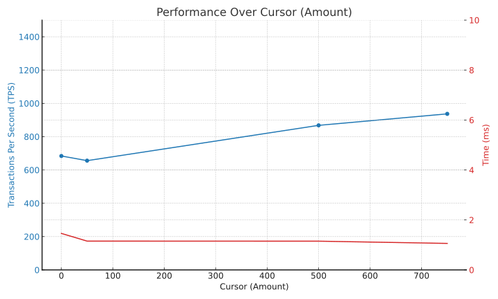
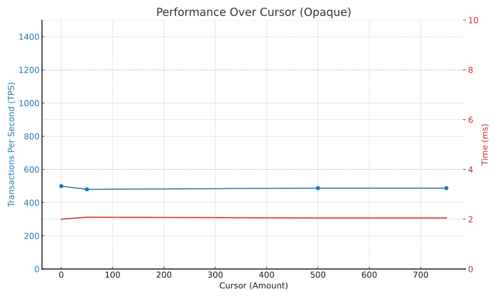

# Pagination in Postgres

## Docker Setup

```bash
# state management
docker volume create pgdata
docker volume rm pgdata

# fast instance
docker run --rm \
  --name pg \
  -e POSTGRES_PASSWORD=postgres \
  -v pgdata:/var/lib/postgresql/data \
  -v ./benchmark:/b \
  -p 5432:5432 postgres

# test instance
docker run --rm \
  --name pg \
  -e POSTGRES_PASSWORD=postgres \
  -v pgdata:/var/lib/postgresql/data \
  -v ./benchmark:/b \
  -p 5432:5432 \
  --memory="256m" \
  --cpus="0.5" postgres \
  -c shared_buffers=64MB \
  -c work_mem=1MB \
  -c maintenance_work_mem=64MB \
  -c max_connections=10
```

## Queries

Run a query:

```bash
docker exec -it pg psql -U postgres -d postgres -f /b/relay.sql
```

Benchmark a query:

```bash
# Optional: init pgbenchmark
docker exec -it pg pgbench -U postgres -i postgres

# Run the benchmark
docker exec -it pg pgbench -U postgres -c 4 -j 2 -t 100 -f /b/offset-1.sql postgres
```

## Schema

```sql
DROP TABLE IF EXISTS invoices CASCADE;

CREATE TABLE invoices (
  id SERIAL PRIMARY KEY,
  user_id TEXT NOT NULL,
  amount INT NOT NULL,
  date TIMESTAMP WITHOUT TIME ZONE NOT NULL,
  product_id TEXT NOT NULL
);

--
-- INDEXES
-- Avoid indexes i
--

-- Tip: add the indexes AFTER the data seeding
-- https://www.cybertec-postgresql.com/en/postgresql-create-indexes-after-bulk-loading/
CREATE INDEX user_id_idx ON invoices (user_id);
CREATE INDEX product_id_idx ON invoices (product_id);
CREATE INDEX date_idx ON invoices (date);

CREATE INDEX user_id_id_idx ON invoices (user_id, id asc);
CREATE INDEX user_date_idx ON invoices (user_id, date desc);
CREATE INDEX user_amount_id_idx ON invoices (user_id, amount, id);

DROP INDEX user_id_idx;
DROP INDEX product_id_idx;
DROP INDEX date_idx;

DROP INDEX user_id_id_idx;
DROP INDEX user_date_idx;
DROP INDEX user_amount_id_idx;
```

Utilities:

```sql
TRUNCATE invoices RESTART IDENTITY;

SELECT count(*) FROM invoices;

SELECT COUNT(DISTINCT user_id) AS total_unique_users FROM invoices;

SELECT COUNT(DISTINCT product_id) AS total_unique_products FROM invoices;

SELECT EXTRACT(YEAR FROM age(MAX(date), MIN(date))) AS years_difference FROM invoices;
```

## Seed

```sql
-- This takes ~40s on my Mac
-- Indexing AFTER seeding takes ~40s
INSERT INTO invoices (user_id, date, amount, product_id)
SELECT
  'user' || floor(random() * 1000)::text AS user_id,
  timestamp 'now' - interval '1 day' * floor(random() * 3650) AS date,
  floor(random() * 1000),
  'product' || floor(random() * 1000)::text AS product_id
FROM generate_series(1, 10000000) s;
```

## Offset Pagination

```sql
CREATE INDEX user_id_id_idx ON invoices (user_id, id asc);
```

```sql
-- Offest formula:
SELECT * FROM invoices
WHERE user_id = 'user123'
ORDER BY id ASC
LIMIT $page_size
OFFSET $page_size * ($page_num - 1)
```

```sql
-- Page 1
-- 878 tps (~1.13ms)
SELECT * FROM invoices
WHERE user_id = 'user123'
ORDER BY id ASC
LIMIT 10
OFFSET 10 * (1 - 1);

-- Page 10
-- 792 tps (1.26ms) -> -10%
SELECT * FROM invoices
WHERE user_id = 'user123'
ORDER BY id ASC
LIMIT 10
OFFSET 10 * (10 - 1);

-- Page 100
-- 275 tsp (3.63ms) -> -68%
--
SELECT * FROM invoices
WHERE user_id = 'user123'
ORDER BY id ASC
LIMIT 10
OFFSET 10 * (100 - 1);

-- Page 500
-- 72 tps (~13.88ms) -> -91%
SELECT * FROM invoices
WHERE user_id = 'user123'
ORDER BY id ASC
LIMIT 10
OFFSET 10 * (500 - 1);
```

```bash
docker exec -it pg pgbench -U postgres -c 4 -j 2 -t 100 -f /b/offset-1.sql postgres
docker exec -it pg pgbench -U postgres -c 4 -j 2 -t 100 -f /b/offset-10.sql postgres
docker exec -it pg pgbench -U postgres -c 4 -j 2 -t 100 -f /b/offset-100.sql postgres
docker exec -it pg pgbench -U postgres -c 4 -j 2 -t 100 -f /b/offset-500.sql postgres
```



## Select Count

```sql
-- 0.27 tps (~3700ms)
SELECT CEIL(COUNT(*) / 10) FROM invoices
WHERE user_id = 'user123';
```

```bash
docker exec -it pg pgbench -U postgres -c 4 -j 2 -t 10 -f /b/count-pages.sql postgres
```

## Cursor Pagination

### By Primary Key

A primary key is already an index so performances are rather fast.

```sql
-- 165 tps (~6ms)
SELECT * FROM invoices
WHERE user_id = 'user123'
  AND id > 0
LIMIT 10;

-- 184 tps (~5ms) -> +11%
SELECT * FROM invoices
WHERE user_id = 'user123'
  AND id > 10000
LIMIT 10;

-- 173 tps (~5ms) -> +5%
SELECT * FROM invoices
WHERE user_id = 'user123'
  AND id > 100000
LIMIT 10;

-- 160 tps (~6ms) -> -3%
SELECT * FROM invoices
WHERE user_id = 'user123'
  AND id > 100000
LIMIT 10;
```

```bash
docker exec -it pg pgbench -U postgres -c 4 -j 2 -t 100 -f /b/cursor-id-p0.sql postgres
docker exec -it pg pgbench -U postgres -c 4 -j 2 -t 100 -f /b/cursor-id-p1.sql postgres
docker exec -it pg pgbench -U postgres -c 4 -j 2 -t 100 -f /b/cursor-id-p2.sql postgres
docker exec -it pg pgbench -U postgres -c 4 -j 2 -t 100 -f /b/cursor-id-p3.sql postgres
```



### By Date

When we move to a different cursor, such as date, the performances go down quickly because we are forcing the engine to peform a full sorting before actually fetch the data.

Whenever we want to make a dataset sortable for a specific condition, or set of condition, it is best to create a specific index for the scenario, that will provide the best possible performance.

Please take into account that by speeding up reads you are introducing more workload at write time (INSERT, UPDATE, DELETE), and that the new index will consume disk space and impact I/O as well.

```sql
CREATE INDEX user_date_idx ON invoices (user_id, date desc);
```

```sql
-- 875 tps (~1ms)
SELECT * FROM invoices
WHERE user_id = 'user123'
  AND date < now()
ORDER BY date DESC
LIMIT 10;

-- 1102 tps (~1ms) -> +25%
SELECT * FROM invoices
WHERE user_id = 'user123'
  AND date < now() - '1 month'::interval
ORDER BY date DESC
LIMIT 10;

-- 977 tps (~1ms) -> +11%
SELECT * FROM invoices
WHERE user_id = 'user123'
  AND date < now() - '1 year'::interval
ORDER BY date DESC
LIMIT 10;

-- 794 tps (~1ms) -> +9%
SELECT * FROM invoices
WHERE user_id = 'user123'
  AND date < now() - '5 years'::interval
LIMIT 10;
```

```bash
docker exec -it pg pgbench -U postgres -c 4 -j 2 -t 100 -f /b/cursor-date-p0.sql postgres
docker exec -it pg pgbench -U postgres -c 4 -j 2 -t 100 -f /b/cursor-date-p1.sql postgres
docker exec -it pg pgbench -U postgres -c 4 -j 2 -t 100 -f /b/cursor-date-p2.sql postgres
docker exec -it pg pgbench -U postgres -c 4 -j 2 -t 100 -f /b/cursor-date-p3.sql postgres
```



## Combined Cursor Pagination

If we want to order my dataset by a dimension that cannot guarantee uniqueness, we need to introduce multi-dimensional cursors.

Usually, the primary key is used in combination with the primary mean of sorting.

```sql
CREATE INDEX user_amount_id_idx ON invoices (user_id, amount, id);
```

```sql
-- Slow query as the amount increase
SELECT * FROM invoices
WHERE user_id = 'user123'
  AND (amount > 0 OR (amount = 0 AND id > 0))
ORDER BY amount ASC, id ASC
LIMIT 10;
```

Avoid the `OR` statement to make a better utilization of the composite index:

```sql
-- 684 tps (~1.46ms)
(
  SELECT * FROM invoices
  WHERE user_id = 'user123'
    AND amount > 0
  ORDER BY amount ASC, id ASC
  LIMIT 10
)
UNION ALL
(
  SELECT * FROM invoices
  WHERE user_id = 'user123'
    AND amount = 0
    AND id > 0
  ORDER BY amount ASC, id ASC
  LIMIT 10
)
ORDER BY amount ASC, id ASC
LIMIT 10;

-- 656 tps (~1.52ms) ->
(
  SELECT * FROM invoices
  WHERE user_id = 'user123'
    AND amount > 50
  ORDER BY amount ASC, id ASC
  LIMIT 10
)
UNION ALL
(
  SELECT * FROM invoices
  WHERE user_id = 'user123'
    AND amount = 50
    AND id > 0
  ORDER BY amount ASC, id ASC
  LIMIT 10
)
ORDER BY amount ASC, id ASC
LIMIT 10;

-- 868 tps (~1.15ms) -> +2%
(
  SELECT * FROM invoices
  WHERE user_id = 'user123'
    AND amount > 500
  ORDER BY amount ASC, id ASC
  LIMIT 10
)
UNION ALL
(
  SELECT * FROM invoices
  WHERE user_id = 'user123'
    AND amount = 500
    AND id > 0
  ORDER BY amount ASC, id ASC
  LIMIT 10
)
ORDER BY amount ASC, id ASC
LIMIT 10;

-- 937 tps (~1.06ms) -> +2%
(
  SELECT * FROM invoices
  WHERE user_id = 'user123'
    AND amount > 750
  ORDER BY amount ASC, id ASC
  LIMIT 10
)
UNION ALL
(
  SELECT * FROM invoices
  WHERE user_id = 'user123'
    AND amount = 750
    AND id > 0
  ORDER BY amount ASC, id ASC
  LIMIT 10
)
ORDER BY amount ASC, id ASC
LIMIT 10;
```

```bash
docker exec -it pg pgbench -U postgres -c 8 -j 5 -t 1000 -f /b/cursor-amount-p0.sql postgres
docker exec -it pg pgbench -U postgres -c 8 -j 5 -t 1000 -f /b/cursor-amount-p1.sql postgres
docker exec -it pg pgbench -U postgres -c 8 -j 5 -t 1000 -f /b/cursor-amount-p2.sql postgres
docker exec -it pg pgbench -U postgres -c 8 -j 5 -t 1000 -f /b/cursor-amount-p3.sql postgres
```

```prompt
generate the chart in svg
the page goes in X
tsp and ms goe in Y
tsp should be blue
ms should be red
title: Performance Over Cursor (Amount)
x title: Cursor

the range of tsp is 0-1500
the range of ms is 0-10

here is the updated dataset:
- amount 0, 684 tsp, 1.46ms
- amount 50, 656 tsp, 1.152ms
- amount 500, 868 tps, 1.15ms
- amount 750, 937 tsp, 1.06ms
```



## Combined Cursors Automation

First of all, let's simplify the input to the query using a CTE:

```sql
WITH
params(page_size, user_id, last_amount, last_id) AS (
  VALUES (10, 'user123', 0, 0)
)(
  SELECT * FROM invoices
  WHERE user_id = (SELECT user_id FROM params)
    AND amount > (SELECT last_amount FROM params)
  ORDER BY amount ASC, id ASC
  LIMIT (SELECT page_size FROM params)
) UNION ALL (
  SELECT * FROM invoices
  WHERE user_id = (SELECT user_id FROM params)
    AND amount = (SELECT last_amount FROM params)
    AND id > (SELECT last_id FROM params)
  ORDER BY amount ASC, id ASC
  LIMIT (SELECT page_size FROM params)
)
ORDER BY amount ASC, id ASC
LIMIT (SELECT page_size FROM params);
```

This way, we can just change the first part of the query to pilot the pagination

```sql
-- First Page
...
VALUES (10, 'user123', 0, 0)
...

-- Next Page
...
VALUES (10, 'user123', 51, 76284)
...
```

Now the goal is to facilitate the fetching of the next page by providing a single value that should be sent back:

```sql
(amount || '-' || id) AS cursor
```

```sql
WITH d(page_size, user_id, last_amount, last_id) AS (
  VALUES (10, 'user123', 0, 0)
)(
  SELECT *, (amount || '-' || id) AS cursor FROM invoices
  WHERE user_id = (SELECT user_id FROM d)
    AND amount > (SELECT last_amount FROM d)
  ORDER BY amount ASC, id ASC
  LIMIT (SELECT page_size FROM d)
) UNION ALL (
  SELECT *, (amount || '-' || id) AS cursor FROM invoices
  WHERE user_id = (SELECT user_id FROM d)
    AND amount = (SELECT last_amount FROM d)
    AND id > (SELECT last_id FROM d)
  ORDER BY amount ASC, id ASC
  LIMIT (SELECT page_size FROM d)
)
ORDER BY amount ASC, id ASC
LIMIT (SELECT page_size FROM d);
```

The final step is to read back a cursor and use it into our query:

```sql
WITH
params(page_size, user_id, last_cursor) AS (
  VALUES (10, 'user123', '0-377280')
),
tokens AS (
  SELECT
    COALESCE(NULLIF(SPLIT_PART(last_cursor, '-', 1), ''), '0')::INT AS last_amount,
    COALESCE(NULLIF(SPLIT_PART(last_cursor, '-', 2), ''), '0')::INT AS last_id
  FROM params
)(
  SELECT *, (amount || '-' || id) AS cursor FROM invoices
  WHERE user_id = (SELECT user_id FROM params)
    AND amount > (SELECT last_amount FROM tokens)
  ORDER BY amount ASC, id ASC
  LIMIT (SELECT page_size FROM params)
) UNION ALL (
  SELECT *, (amount || '-' || id) AS cursor FROM invoices
  WHERE user_id = (SELECT user_id FROM params)
    AND amount = (SELECT last_amount FROM tokens)
    AND id > (SELECT last_id FROM tokens)
  ORDER BY amount ASC, id ASC
  LIMIT (SELECT page_size FROM params)
)
ORDER BY amount ASC, id ASC
LIMIT (SELECT page_size FROM params);
```

## Opaque Cursors

```sql
-- encode the cursor
encode(convert_to(amount || '-' || id, 'UTF8'), 'base64') AS cursor

-- decode the cursor
convert_from(decode(last_cursor, 'base64'), 'UTF8')
```

```sql
WITH
params(page_size, user_id, last_cursor) AS (
  VALUES (10, 'user123', null)
),
tokens AS (
  SELECT
    COALESCE(NULLIF(SPLIT_PART(convert_from(decode(last_cursor, 'base64'), 'UTF8'), '-', 1), ''), '0')::INT AS last_amount,
    COALESCE(NULLIF(SPLIT_PART(convert_from(decode(last_cursor, 'base64'), 'UTF8'), '-', 2), ''), '0')::INT AS last_id
  FROM params
)(
  SELECT *, encode(convert_to(amount || '-' || id, 'UTF8'), 'base64') AS cursor FROM invoices
  WHERE user_id = (SELECT user_id FROM params)
    AND amount > (SELECT last_amount FROM tokens)
  ORDER BY amount ASC, id ASC
  LIMIT (SELECT page_size FROM params)
) UNION ALL (
  SELECT *, encode(convert_to(amount || '-' || id, 'UTF8'), 'base64') AS cursor FROM invoices
  WHERE user_id = (SELECT user_id FROM params)
    AND amount = (SELECT last_amount FROM tokens)
    AND id > (SELECT last_id FROM tokens)
  ORDER BY amount ASC, id ASC
  LIMIT (SELECT page_size FROM params)
)
ORDER BY amount ASC, id ASC
LIMIT (SELECT page_size FROM params);
```

```sql
-- First Page
WITH
params(page_size, user_id, last_cursor) AS (
  VALUES (10, 'user123', null)
)
...

-- Next Page
WITH
params(page_size, user_id, last_cursor) AS (
  VALUES (10, 'user123', 'MS02OTI2NjY5')
)
...
```

It becomes easy to generate cursors for the performance tests:

```sql
select encode(convert_to(0 || '-' || 0, 'UTF8'), 'base64');
select encode(convert_to(50 || '-' || 0, 'UTF8'), 'base64');
select encode(convert_to(500 || '-' || 0, 'UTF8'), 'base64');
select encode(convert_to(750 || '-' || 0, 'UTF8'), 'base64');
```

```bash
docker exec -it pg pgbench -U postgres -c 8 -j 5 -t 1000 -f /b/cursor-opaque-p0.sql postgres
docker exec -it pg pgbench -U postgres -c 8 -j 5 -t 1000 -f /b/cursor-opaque-p1.sql postgres
docker exec -it pg pgbench -U postgres -c 8 -j 5 -t 1000 -f /b/cursor-opaque-p2.sql postgres
docker exec -it pg pgbench -U postgres -c 8 -j 5 -t 1000 -f /b/cursor-opaque-p3.sql postgres
```

```prompt
generate the chart in svg
the page goes in X
tsp and ms goe in Y
tsp should be blue
ms should be red
title: Performance Over Cursor (Opaque)
x title: Cursor

the range of tsp is 0-1500
the range of ms is 0-10

here is the updated dataset:
- amount 0, 499 tsp, 2.00ms
- amount 50, 480 tsp, 2.08ms
- amount 500, 487 tps, 2.05ms
- amount 750, 487 tsp, 2.05ms
```



Also here it is clearly visibile that the performances do not degrade with the progress of the cursor.
It is also noticeable that we are loading our limited db with more calculations (base64 does not come cheap).

## Relay APIs

```sql
WITH
params(page_size, user_id, last_cursor) AS (
  VALUES (10, 'user123', null)
),
tokens AS (
  SELECT
    COALESCE(NULLIF(SPLIT_PART(convert_from(decode(last_cursor, 'base64'), 'UTF8'), '-', 1), ''), '0')::INT AS last_amount,
    COALESCE(NULLIF(SPLIT_PART(convert_from(decode(last_cursor, 'base64'), 'UTF8'), '-', 2), ''), '0')::INT AS last_id
  FROM params
),
dataset as (
  (
    SELECT *, encode(convert_to(amount || '-' || id, 'UTF8'), 'base64') AS cursor FROM invoices
    WHERE user_id = (SELECT user_id FROM params)
      AND amount > (SELECT last_amount FROM tokens)
    ORDER BY amount ASC, id ASC
    LIMIT (SELECT page_size FROM params)
  ) UNION ALL (
    SELECT *, encode(convert_to(amount || '-' || id, 'UTF8'), 'base64') AS cursor FROM invoices
    WHERE user_id = (SELECT user_id FROM params)
      AND amount = (SELECT last_amount FROM tokens)
      AND id > (SELECT last_id FROM tokens)
    ORDER BY amount ASC, id ASC
    LIMIT (SELECT page_size FROM params)
  )
  ORDER BY amount ASC, id ASC
  LIMIT (SELECT page_size FROM params)
)
SELECT json_build_object(
  'next', (SELECT id FROM dataset ORDER BY id DESC LIMIT 1 OFFSET 10),
  'has_more', (SELECT count(*) > 10 FROM dataset),
  'data', (SELECT json_agg(t) FROM (SELECT * FROM dataset LIMIT 10) t)
) AS result_json;
```
