# PostgreSQL + Hasura.io = Backend-less GraphQL APIs

The goal of this project is to create the GraphQL APIs for a simple e-commerce solution using PostgreSQL and Hasura.io.

---

## Table of Contents

- [Prerequisites](#prerequisites)
- [Run the Project](#run-the-project)
- [Docker-Compose 101](#docker-compose-101)
  - [PostgreSQL on Docker-Compose](#postgresql-on-docker-compose)
  - [Adminer on Docker-Compose](#adminer-on-docker-compose)
  - [Hasura.io on Docker-Compose](#hasuraio-on-docker-compose)
- [Basic Schema](#basic-schema)
  - [tenants](#tenants)
  - [products](#products)
  - [movements](#movements)
- [Data Seeding](#data-seeding)
  - [Insert a Single Value](#insert-a-single-value)
  - [Insert Multiple Values](#insert-multiple-values)
  - [Upsert Exising Values](#upsert-exising-values)
  - [Reset Data](#reset-data)
  - [Generate Series](#generate-series)
  - [Generate Randomic Data](#generate-randomic-data)
  - [Generate Randomic Timestamp](#generate-randomic-timestamp)
  - [Work With Regular Expressions](#work-with-regular-expressions)
- [Tracking Tables with Hasura.io](#tracking-tables-with-hasuraio)
- [Hasura Queries](#hasura-queries)
  - [Single Table Query](#single-table-query)
  - [Fetching Related Data](#fetching-related-data)
  - [Data Aggregation](#data-aggregation)
  - [Query Params](#query-params)
  - [Rename Fields & Sub Queries](#rename-fields--sub-queries)
- [Hasura Mutations](#hasura-mutations)
  - [Insert Single Record](#insert-single-record)
  - [Insert Single Record (variant)](#insert-single-record-variant)
  - [Insert Multiple Records](#insert-multiple-records)
  - [Insert Nested Data](#insert-nested-data)
- [Custom Relationships on Multiple Fields](#custom-relationships-on-multiple-fields)
- [Data Aggregation & Views](#data-aggregation--views)
  - [The Availability Query](#the-availability-query)
  - [The Availability View](#the-availability-view)
  - [PostgreSQL Views & Hasura.io](#postgresql-views--hasuraio)
  - [Materialized Views](#materialized-views)
- [Test For Performance Issues](#test-for-performance-issues)
- [Role-based Access Control](#role-based-access-control)
  - [Access Control Headers](#access-control-headers)
  - [The Tenant Role](#the-tenant-role)
  - [Give Tenant Access To Products](#give-tenant-access-to-products)
  - [Insert Products By Tenant](#insert-products-by-tenant)
  - [Update Products By Tenant](#update-products-by-tenant)
  - [Delete Products By Tenant](#delete-products-by-tenant)
  - [Propagating Permissions](#propagating-permissions)
- [Backup & Restore](#backup--restore)
  - [Manually Import/Export Metadata](#manually-importexport-metadata)
  - [The Hasura CLI](#the-hasura-cli)
  - [Install Hasura CLI](#install-hasura-cli)
  - [Initialize Your Codebase From a Running Instance](#initialize-your-codebase-from-a-running-instance)
  - [Hasura Project Structure](#hasura-project-structure)
  - [Export PostgreSQL Schema](#export-postgresql-schema)
  - [Export Hasura Metadata](#export-hasura-metadata)
  - [Import PostgreSQL Schema](#import-postgresql-schema)
  - [Import Hasura Metadata](#import-hasura-metadata)
  - [Create a Seed File](#create-a-seed-file)
  - [Seed Data](#seed-data)
- [Public Products View](#public-products-view)
  - [Recursive Materialized Views](#recursive-materialized-views)
  - [Refresh Materialized View Concurrently](#refresh-materialized-view-concurrently)
  - [Expose The Public Products View](#expose-the-public-products-view)
  - [Derive a REST Endpoint From a GraphQL Query](#derive-a-rest-endpoint-from-a-graphql-query)
  - [Parametrized REST Endpoint](#parametrized-rest-endpoint)

---

## Prerequisites

The following notes are written using MacOS as running environment and assume you have the following software installed on your machine:

- [Docker][docker]
- [Make][make]

👉 [Read about the general prerequisites here. 🔗](../../README.md#prerequisites-for-running-the-examples)

👉 [You can also do it on a GitPod.io Workspace! 🔗](https://gitpod.io#https://github.com/marcopeg/gitpod-workspace)

[](https://gitpod.io#https://github.com/marcopeg/gitpod-workspace)

---

## Run the Project

This project simulates a PostgreSQL extension with its own unit tests.  
Run the following commands to run it:

```bash
# Build the "pgtap" image and start PostgreSQL with Docker
make start

# Stop the running PostgreSQL and remove the container
# (data is still persisted to the local disk)
make stop
```

---

## Docker-Compose 101

[Docker-Compose][docker-compose] helps you run multi-container projects using a [YAML][yaml] file to declare each container properties and relations.

The basic structure of a Docker-Compose project is defined in a `docker-compose.yml` file:

```yaml
version: "3.9"
services:
  postgres:
  hasura:
```

- the `version` key identifies the project's capabilities and running APIs
- the `services` key contains a list of each container, identified by its name

### PostgreSQL on Docker-Compose

We can run PosrgreSQL using the latest version from the [Official Docker Image](https://hub.docker.com/_/postgres):

```yml
postgres:
  image: postgres:14
  ports:
    - "${POSTGRES_PORT:-5432}:5432"
  volumes:
    - .docker-data/pg:/var/lib/postgresql/data
  environment:
    POSTGRES_PASSWORD: ${POSTGRES_PASSWORD:-postgres}
```

- `ports` maps the container's exposed ports to the host machine
- `volumes` maps the container's file system to some folders on the host machine, it is used so data survives the temporary destruction of a container
- `environent` passes configuration to the container's service, you learn what variabile you need to set into the image's documentation page

👉 here we use `${POSTGRES_PORT:-5432}` which is a way to define values that let configure the value using a `.env` file.

If you want to change PostgreSQL's port, create a `.env` file and try to write:

```bash
POSTGRES_PORT=7777
```

You can use the same approach for the password or other configuration that you may want to add.

### Adminer on Docker-Compose

[Adminer][adminer] offers a simple web-based database administration interface, and we are going to use it to explore our schema and run experimental queries.

We can run it as a Docker-Compose service using the [Official Docker Image](https://hub.docker.com/_/adminer):

```yml
adminer:
  image: adminer:4.8.1
  ports:
    - "${ADMINER_PORT:-8008}:8080"
```

👉 Once you visit `http://localhost:8008` you can use the value `postgres` in each field of the login form and gain access to you local PostgreSQL instance.

### Hasura.io on Docker-Compose

[Hasura.io][hasura] generates a [GraphQL][graphql] API starting from a database schema and some YAML-based configuration rules.

We can run it as a Docker-Compose service using the [Official Docker Image](https://hub.docker.com/r/hasura/graphql-engine):

```yml
hasura:
  image: hasura/graphql-engine:v2.7.0
  ports:
    - "${HASURA_PORT:-8080}:8080"
  environment:
    HASURA_GRAPHQL_DEV_MODE: "true"
    HASURA_GRAPHQL_ENABLE_CONSOLE: "true"
    HASURA_GRAPHQL_ADMIN_SECRET: "${HASURA_ADMIN_SECRET:-hasura}"
    HASURA_GRAPHQL_UNAUTHORIZED_ROLE: "anonymous"
    HASURA_GRAPHQL_DATABASE_URL: postgres://postgres:${POSTGRES_PASSWORD:-postgres}@postgres:5432/postgres
    HASURA_GRAPHQL_ENABLED_LOG_TYPES: startup, http-log, webhook-log, websocket-log, query-log
    HASURA_GRAPHQL_ENABLE_TELEMETRY: "false"
  restart: unless-stopped
```

👉 Once you visit `http://localhost:8080` you can use the value `hasura` to gain access to the console interface.

---

## Basic Schema

We want to run a multi-tenant and multi-user e-commerce service, so at the very least we need to show some products based on the shop someone is visiting.

Let's say that our first goal is to create a **products list** page that answers to the URL:  
`http://my-web-shop.com/:tenant`

We will need a few tables then:

- tenants
- products
- movements

### tenants

| name | type |
| ---- | ---- |
| id   | text |
| name | text |

👉 For sake of simplicity we will use text-based IDs like `t1`, `t2`. It will facilitate the data-seeding and the testing of our system.

```sql
CREATE TABLE "public"."tenants" (
  "id" TEXT,
  "name" TEXT NOT NULL,
  CONSTRAINT "tenants_pkey" PRIMARY KEY ("id")
);
```

### products

In this table we want to list the products that are sold by each tenant:

| name        |  type     | default |
| ----------- | --------- | ------- |
| id          | text      | -       |
| tenant_id   | text      | -       |
| is_visible  | boolean   | true    |
| name        | text      | -       |
| description | text      | -       |
| price       | integer   | -       |
| created_at  | timestamp |  now()  |
| updated_at  | timestamp |  now()  |

👉 For sake of simplicity we will use text-based IDs like `p1`, `p2`. It will facilitate the data-seeding and the testing of our system.

```sql
CREATE TABLE "public"."products" (
  "id" TEXT NOT NULL,
  "tenant_id" TEXT NOT NULL,
  "is_visible" BOOLEAN DEFAULT TRUE NOT NULL,
  "name" TEXT NOT NULL,
  "description" TEXT NOT NULL,
  "price" INTEGER NOT NULL,
  "created_at" TIMESTAMPTZ DEFAULT NOW() NOT NULL,
  "updated_at" TIMESTAMPTZ DEFAULT NOW() NOT NULL,
  CONSTRAINT "products_pkey" PRIMARY KEY ("id")
);
```

#### Data Validation

Next we want to add a simple **validation rule** that avoids stupid mistakes like setting negative prices on a product.

You can go a long way into enforcing data integrity with checks:

```sql
-- Create the constraint:
ALTER TABLE "public"."products"
ADD CONSTRAINT "products_price_check"
CHECK (price > 0);

-- Remove the constraint:
ALTER TABLE "products"
DROP CONSTRAINT "products_price_check"
```

- try to add or update a product with a negative price _before and after_ setting the check
- try to add a product with `price=0` _before_ adding the check, then try to add the check

#### Relational Data Integrity

The `tenant_id` is a logical link to the `tenants` table, but we can make this relation explicit to the PostgreSQL, and set rules how to handle related data events.

```sql
-- Create the constraint:
ALTER TABLE ONLY "public"."products"
ADD CONSTRAINT "products_tenant_id_fkey"
FOREIGN KEY (tenant_id) REFERENCES tenants(id)
ON UPDATE CASCADE
ON DELETE CASCADE
NOT DEFERRABLE;

-- Remove the constraint:
ALTER TABLE "products"
DROP CONSTRAINT "products_tenant_id_fkey"
```

- try to add a product thar reference a non-existent tenant _before and after_ adding the constraint
- try to add a few products for a specific tenant, and then delete the tenant, _before and after_ adding the constraint

#### Data Automation

The last step for this table is to add a simple automation and automagically update the `updated_at` value every time the product line changes.

```sql
CREATE FUNCTION "public"."set_current_timestamp_updated_at"()
RETURNS TRIGGER
LANGUAGE plpgsql
AS $$
BEGIN
  NEW."updated_at" = NOW();
  RETURN NEW;
END;
$$;

CREATE TRIGGER "set_public_products_updated_at"
BEFORE UPDATE ON "public"."products"
FOR EACH ROW EXECUTE FUNCTION "public"."set_current_timestamp_updated_at"();
```

> 🚧 Can you modify this function as so to update `updated_at` only when the `price` changes?

### movements

This table tracks the changes in produts availability.

It is a _timeserie_ where we will only INSERT an immutable list of information that record "what happened" to a specific product.

|  name      | type      | default       |
| ---------- | --------- | ------------- |
| id         | integer   | autoincrement |
| tenant_id  | text      | -             |
| product_id | text      | -             |
| created_at | timestamp | current-time  |
| amount     | integer   | 0             |
| note       | text      | -             |

```sql
CREATE SEQUENCE "movements_id_seq"
INCREMENT 1
MINVALUE 1
MAXVALUE 2147483647
CACHE 1;

CREATE TABLE "public"."movements" (
  "id" INTEGER NOT NULL DEFAULT nextval('movements_id_seq'),
  "tenant_id" TEXT NOT NULL,
  "product_id" TEXT NOT NULL,
  "created_at" TIMESTAMPTZ DEFAULT NOW() NOT NULL,
  "amount" INTEGER NOT NULL,
  "note" TEXT NOT NULL,
  CONSTRAINT "movements_pkey" PRIMARY KEY ("id")
);
```

You can play around with sequences as they were tables:

```sql
-- Get the current value:
SELECT "last_value" FROM "public"."movements_id_seq";

-- Increase the value and read it out:
SELECT nextval('movements_id_seq') AS "next_value";

-- Set the sequence to a specific value:
SELECT setval('movements_id_seq', 100);
```

And here is a handy query that will reset the sequence to the maximum value from a target table/column:

```sql
SELECT setval('movements_id_seq', COALESCE((
  SELECT MAX(id) + 1 FROM "public"."movements"
), 1), false);
```

Next step is to add the relational data integrity constraints:

```sql
ALTER TABLE ONLY "public"."movements"
ADD CONSTRAINT "movements_tenant_id_fkey"
FOREIGN KEY (tenant_id) REFERENCES tenants(id)
ON UPDATE CASCADE
ON DELETE CASCADE
NOT DEFERRABLE;

ALTER TABLE ONLY "public"."movements"
ADD CONSTRAINT "movements_product_id_fkey"
FOREIGN KEY (product_id) REFERENCES products(id)
ON UPDATE CASCADE
ON DELETE CASCADE
NOT DEFERRABLE;
```

---

## Data Seeding

It is extremely important to learn how to generated dataset that we can use to test our software.

We can use it to run 2 types of test:

- data integrity
- performance bottlenecks

### Insert a Single Value

```sql
INSERT INTO "tenants" ("id", "name")
VALUES ('t1', 'tenant1');
```

### Insert Multiple Values

```sql
INSERT INTO "public"."tenants" ("id", "name")
VALUES
  ('t2', 'tenant2')
, ('t3', 'tenant3')
, ('t4', 'tenant4')
;
```

### Upsert Exising Values

```sql
INSERT INTO "public"."tenants" ("id", "name")
VALUES
  ('t2', 'tenant2')
, ('t3', 'tenant3')
, ('t4', 'tenant4')
-- handle conflicts:
ON CONFLICT ON CONSTRAINT "tenants_pkey"
DO UPDATE SET "name" = EXCLUDED."name";
```

### Reset Data

```sql
TRUNCATE "public"."tenants"
RESTART IDENTITY
CASCADE;
```

### Generate Series

You can use `generate_series` to produce an arbitrary amount of rows:

```sql
SELECT * FROM generate_series(1, 10);
```

Then you can combine such data in order to generate the desired dataset:

```sql
SELECT
  CONCAT('t', "t") AS "id",
  CONCAT('Tenant', "t") AS "name"
FROM generate_series(1, 5) AS "t";
```

Finally, we can put things together and use this strategy to seed an arbitrary amount of data:

```sql
INSERT INTO "public"."tenants" ("id", "name")

-- Describe the dataset:
SELECT
  CONCAT('t', "t") AS "id",
  CONCAT('Tenant', "t") AS "name"

-- Set the size of the dataset:
FROM generate_series(1, 10) AS "t"

-- Manage conflicts with existing values:
ON CONFLICT ON CONSTRAINT "tenants_pkey"
DO UPDATE SET "name" = EXCLUDED."name"

-- Return the dataset that was produced:
RETURNING *;
```

### Generate Randomic Data

So far we have managed to generate and insert 10 tenants, and we could use the same queries to generate thousands of products.

But we have a problem, a product must refer to an existing tenant, and the idea would be to distribute some thousands of products among the different tenants.

> An easy way out would be to associate the product line with a randomic `tenant_id`: `[t1 .. t10]`.

```sql
-- Produce a randomic number between 1 and 10:
SELECT floor(random() * (10 - 1 + 1) + 1);

-- Generate a randomic tenant_id:
SELECT CONCAT('t', floor(random() * (10 - 1 + 1) + 1)) AS "tenant_id";
```

Let's now put the things together:

```sql
INSERT INTO "public"."products"
("id", "tenant_id", "is_visible", "name", "description", "price")

-- Describe the dataset:
SELECT
  CONCAT('p', "p") AS "id",
  -- randomic tenant_id (t1 .. t10)
  CONCAT('t', floor(random() * (10 - 1 + 1) + 1)) AS "tenant_id",
  -- 25% of the products are set as hidden
  random() > 0.25 AS "is_visible",
  CONCAT('Product', "p") AS "name",
  CONCAT('Description for product', "p") AS "description",
  -- randomic price (10 .. 100)
  floor(random() * (10 - 1 + 1) + 1) * 10 AS "price"

-- Set the size of the dataset:
FROM generate_series(1, 100) AS "p"

-- Manage conflicts with existing values:
ON CONFLICT ON CONSTRAINT "products_pkey"
DO UPDATE SET
  "tenant_id" = EXCLUDED."tenant_id",
  "name" = EXCLUDED."name",
  "description" = EXCLUDED."description",
  "price" = EXCLUDED."price",
  "is_visible" = EXCLUDED."is_visible"

-- Return the dataset that was produced:
RETURNING *;
```

### Generate Randomic Timestamp

Now we need to generate some product movements data.

This is somewhat more tricky for 2 reasons:

1. we want to simulate data over a long span of time, say last month
2. we want to randomize the `product_id` very much, but we don't want to hard-code the limits of it

To generate a randomic date we can mix `random()` and `interval`:

```sql
SELECT now() - '30d'::INTERVAL * random();
```

### Work With Regular Expressions

For the randomization of the `product_id`, we know that the IDs are contiguous, but we also know that they are strings, and that we need to know the highest number that is contained into it.

How do we extract `99` from `p99`?

```sql
SELECT NULLIF(regexp_replace('p9', '\D','','g'), '')::INT;
```

So we can get the max value contained into a `product_id`:

```sql
SELECT NULLIF(regexp_replace("id", '\D','','g'), '')::INT
FROM "public"."products"
ORDER BY "id" DESC
LIMIT 1;
```

For the `tenants` table we want to use a slightly different approach because we are **less certain** that the last row contains the highest ID:

```sql
SELECT MAX(NULLIF(regexp_replace("id", '\D','','g'), '')::INT)
FROM "public"."tenants"
```

We can put things together and build our seeding query:

```sql
INSERT INTO "public"."movements"
  ("tenant_id", "product_id", "created_at", "amount", "note")
SELECT
  -- randomic tenant_id in range:
  CONCAT('t', floor(random() * ((
    SELECT MAX(NULLIF(regexp_replace("id", '\D','','g'), '')::INT)
    FROM "public"."tenants"
  )- 1 + 1) + 1)) AS "tenant_id",

  -- randomic product_id in range:
  CONCAT('p', floor(random() * ((
    SELECT NULLIF(regexp_replace("id", '\D','','g'), '')::INT
    FROM "public"."products"
    ORDER BY "id" DESC
    LIMIT 1
  ) - 1 + 1) + 1)) AS "product_id",

  -- randomic created_at within the last 30 days
  now() - '30d'::INTERVAL * random() AS "created_at",

  -- randomic amount between -50 and 100 units
  floor(random() * (100 + 50 + 1) - 50)::int AS "amount",

  -- just a dummy note because we set a non null constraint
  '-'
FROM generate_series(1, 10000) AS "m"
RETURNING *
```

---

## Tracking Tables with Hasura.io

In order to expose a GraphQL API over the data structure that we have created, we need to add the proper configuration into Hasura.

1. Go to the "data" tab
2. Click on the "public" schema
3. Click "track" on each of the tables we created

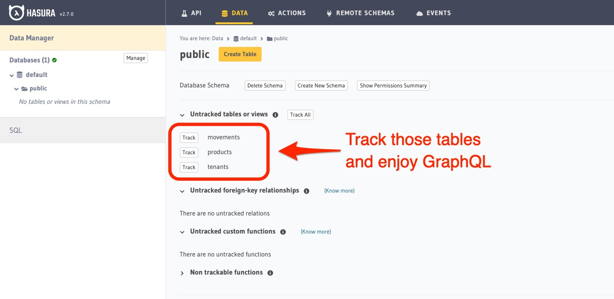

Once Hasura gets to know the tables, it may also offer the possibility to track the _FOREIGN KEYS_ that have been set:

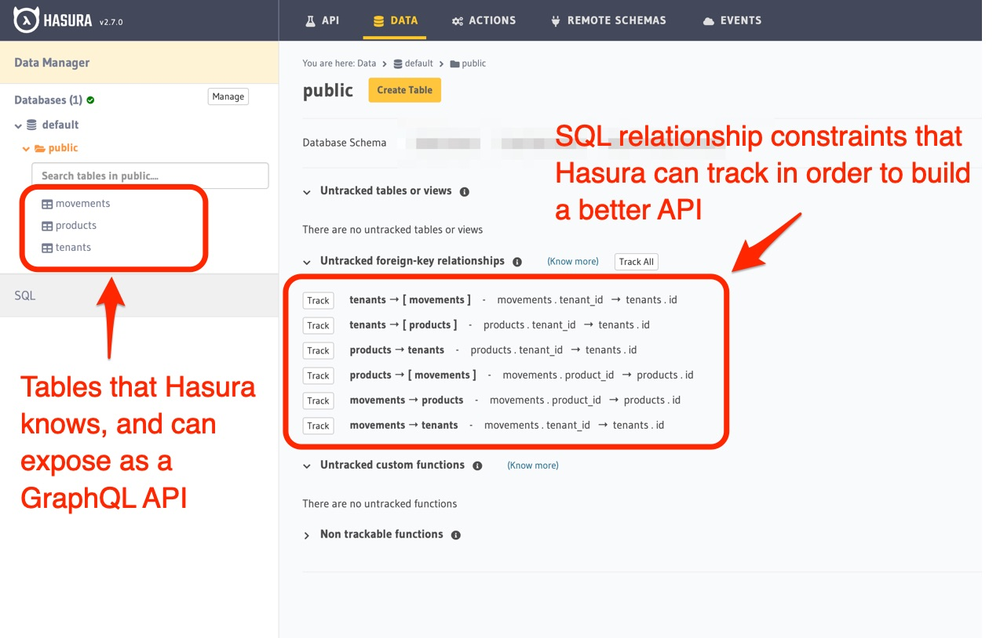

Go ahead and track:

- tenants -> [producs]
- products -> [movements]
- products -> tenants

---

## Hasura Queries

### Single Table Query

Let's now move into the "API" tab and use the "Explorer" panel to build our first query:

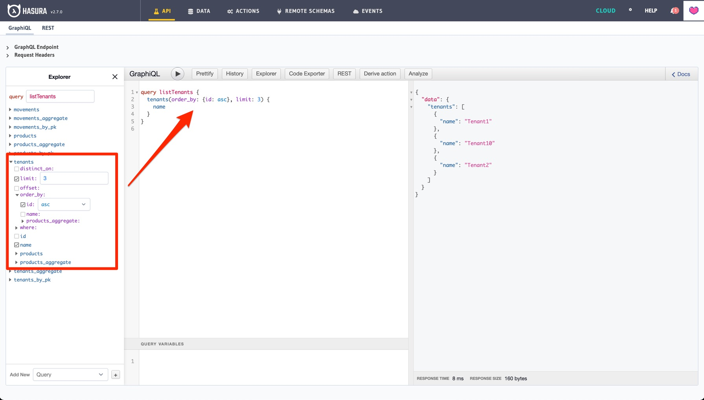

```gql
query listTenants {
  tenants(order_by: { id: asc }, limit: 3) {
    name
  }
}
```

### Fetching Related Data

You should notice that you have `products` as a form of available field into your tenants explorer data-structure.

Open it up and select some products as well:

```gql
query listTenants {
  tenants(order_by: { id: asc }, limit: 3) {
    name
    products(
      where: { is_visible: { _eq: true } }
      order_by: { updated_at: desc }
      limit: 10
    ) {
      name
      price
    }
  }
}
```

👉 This is possible because we tracked the `tenants -> products` relation that Hasura could identify thanks to the _FOREIGN KEY_ that we have set.

We can take this approach even further and list all the movements that have been recorded for each Product:

```gql
query listTenants {
  tenants(order_by: { id: asc }, limit: 3) {
    name
    products(
      where: { is_visible: { _eq: true } }
      order_by: { updated_at: desc }
      limit: 10
    ) {
      name
      price
      movements(order_by: { created_at: asc }) {
        amount
        created_at
      }
    }
  }
}
```

### Data Aggregation

Getting the list of movements is not really useful, is it?

What we really want is to know **the product's availability**, which is the `SUM()` of all the movements:

```gql
query listTenants {
  tenants(order_by: { id: asc }, limit: 3) {
    name
    products(
      where: { is_visible: { _eq: true } }
      order_by: { updated_at: desc }
      limit: 10
    ) {
      name
      price
      movements_aggregate {
        aggregate {
          sum {
            amount
          }
        }
      }
    }
  }
}
```

### Query Params

Let's say we want to create a query that returns the informations for a specific product given its ID:

```gql
query getProduct($productId: String) {
  products(where: { id: { _eq: $productId } }, limit: 1) {
    name
    price
  }
}
```

variables:

{
"productId":"p1"
}

### Rename Fields & Sub Queries

With GraphQL and Hasura you can quickly put together quite complex queries that fetch related data from multiple tables, and generate many sub-queries to extract different aggregated values:

- product's fields
- product's availability out of the movements
- last 10 movements
- tenant's name
- tenant's products stats

```gql
query getProduct($productId: String!) {
  product: products_by_pk(id: $productId) {
    is_visible
    name
    description
    price
    updated_at
    created_at
    available_items: movements_aggregate {
      aggregate {
        sum {
          amount
        }
      }
    }
    last_movements: movements(order_by: { created_at: desc }, limit: 5) {
      created_at
      amount
      note
    }
    tenant {
      id
      name
      total_products: products_aggregate {
        aggregate {
          count(columns: id)
        }
      }
      visible_products: products_aggregate(
        where: { is_visible: { _eq: true } }
      ) {
        aggregate {
          count(columns: id)
        }
      }
      hidden_products: products_aggregate(
        where: { is_visible: { _eq: false } }
      ) {
        aggregate {
          count(columns: id)
        }
      }
    }
  }
}
```

The output looks something like:

```json
{
  "data": {
    "product": {
      "is_visible": true,
      "name": "Product1",
      "description": "Description for product1",
      "price": 80,
      "updated_at": "2022-06-02T07:02:02.400745+00:00",
      "created_at": "2022-06-02T07:02:02.400745+00:00",
      "available_items": {
        "aggregate": {
          "sum": {
            "amount": 192
          }
        }
      },
      "last_movements": [
        {
          "created_at": "2022-06-02T04:25:09.963454+00:00",
          "amount": -33,
          "note": "-"
        },
        {
          "created_at": "2022-06-02T01:22:39.041886+00:00",
          "amount": 38,
          "note": "-"
        },
        {
          "created_at": "2022-06-01T07:58:44.505914+00:00",
          "amount": 52,
          "note": "-"
        },
        {
          "created_at": "2022-05-29T17:33:32.004624+00:00",
          "amount": -49,
          "note": "-"
        },
        {
          "created_at": "2022-05-24T02:13:33.322909+00:00",
          "amount": 76,
          "note": "-"
        }
      ],
      "tenant": {
        "id": "t3",
        "name": "Tenant3",
        "total_products": {
          "aggregate": {
            "count": 8
          }
        },
        "visible_products": {
          "aggregate": {
            "count": 6
          }
        },
        "hidden_products": {
          "aggregate": {
            "count": 2
          }
        }
      }
    }
  }
}
```

---

## Hasura Mutations

### Insert Single Record

```gql
mutation addTenant($id: String!, $name: String!) {
  tenant: insert_tenants_one(
    object: { id: $id, name: $name }
    on_conflict: { constraint: tenants_pkey, update_columns: name }
  ) {
    id
    name
  }
}
```

variables:

```json
{
  "id": "mpe",
  "name": "Marco Peg"
}
```

output:

```json
{
  "data": {
    "tenant": {
      "id": "mpe",
      "name": "Marco Peg"
    }
  }
}
```

🚧 Play out with the conflict management, remove it, learn about Hasura errors.

### Insert Single Record (variant)

This mutation still inserts one single record:

```gql
mutation addTenant($id: String!, $name: String!) {
  tenants: insert_tenants(
    objects: { id: $id, name: $name }
    on_conflict: { constraint: tenants_pkey, update_columns: name }
  ) {
    affected_rows
    records: returning {
      id
      name
    }
  }
}
```

variables:

```json
{
  "id": "mpe",
  "name": "Marco Peg"
}
```

output:

```json
{
  "data": {
    "tenants": {
      "affected_rows": 1,
      "records": [
        {
          "id": "mpe",
          "name": "Marco Peg"
        }
      ]
    }
  }
}
```

### Insert Multiple Records

So far we played with a simple data type to characterize our input: `String`.

But Hasura builds more complex data types based on the schema that we provide.

Use the "Docs" panel on the right side of the GraphiQL editor, and navigate to (or search) the `insert_tenants` definition:

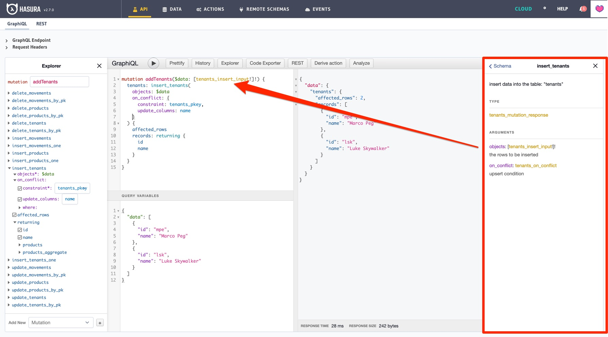

With this new information we can upgrade our mutation and receive a list of values that we want to upsert:

```gql
mutation addTenants($data: [tenants_insert_input!]!) {
  tenants: insert_tenants(
    objects: $data
    on_conflict: { constraint: tenants_pkey, update_columns: name }
  ) {
    affected_rows
    records: returning {
      id
      name
    }
  }
}
```

variables:

```json
{
  "data": [
    {
      "id": "mpe",
      "name": "Marco Peg"
    },
    {
      "id": "lsk",
      "name": "Luke Skywalker"
    }
  ]
}
```

output:

```json
{
  "data": {
    "tenants": {
      "affected_rows": 2,
      "records": [
        {
          "id": "mpe",
          "name": "Marco Peg"
        },
        {
          "id": "lsk",
          "name": "Luke Skywalker"
        }
      ]
    }
  }
}
```

### Insert Nested Data

Thanks to the data relations it is possible to insert nested data in one single mutation:

```gql
mutation addTenants(
  $id: String!
  $name: String!
  $products: [products_insert_input!]!
) {
  tenant: insert_tenants(
    objects: {
      id: $id
      name: $name
      products: {
        data: $products
        on_conflict: {
          constraint: products_pkey
          update_columns: [price, name, description]
        }
      }
    }
    on_conflict: { constraint: tenants_pkey, update_columns: name }
  ) {
    affected_rows
    records: returning {
      id
      name
      products(where: { updated_at: { _eq: "now()" } }) {
        id
        is_visible
        name
        price
        created_at
        updated_at
        movements(where: { created_at: { _eq: "now()" } }) {
          id
          created_at
          amount
          note
        }
      }
    }
  }
}
```

variables:

```json
{
  "id": "mpe",
  "name": "Marco Peg",
  "products": [
    {
      "id": "mpe_p1",
      "name": "First Product",
      "description": "First product from Marco",
      "price": 10,
      "movements": {
        "data": [
          {
            "amount": 1,
            "note": "First load",
            "tenant_id": "mpe"
          }
        ]
      }
    },
    {
      "id": "mpe_p2",
      "name": "Second Product",
      "description": "Second product from Marco",
      "price": 10
    }
  ]
}
```

🔥 Note that we must replicate the `tenant_id`. That is because the relation `product -> movements` is only set on the `id` field.

output:

```json
{
  "data": {
    "tenant": {
      "affected_rows": 4,
      "records": [
        {
          "id": "mpe",
          "name": "Marco Peg",
          "products": [
            {
              "id": "mpe_p1",
              "is_visible": true,
              "name": "First Product",
              "price": 10,
              "created_at": "2022-06-02T08:42:13.483459+00:00",
              "updated_at": "2022-06-02T08:49:15.807776+00:00",
              "movements": [
                {
                  "id": 11087,
                  "created_at": "2022-06-02T08:49:15.807776+00:00",
                  "amount": 1,
                  "note": "First load"
                }
              ]
            },
            {
              "id": "mpe_p2",
              "is_visible": true,
              "name": "Second Product",
              "price": 10,
              "created_at": "2022-06-02T08:43:51.169635+00:00",
              "updated_at": "2022-06-02T08:49:15.807776+00:00",
              "movements": []
            }
          ]
        }
      ]
    }
  }
}
```

---

## Custom Relationships on Multiple Fields

We want to improve the [Insert Nested Data](#insert-nested-data) mutation and avoid the need to duplicate the `tenant_id` inside each _movement_.

To achieve this, we need to setup a custom relationship between `products -> movements` and explain to hasura that both `product.id -> movement.product_id` and `product.tenant_id -> movement.tenant_id`.

1. Go to the "Data" tab
2. Click on the "Products" table from the left menu
3. Click on the "Relationships" tab
4. Under the "Array relationships", click "Edit" on movements
5. Remove the relationship

Now that you have removed the default relationship that Hasura did setup thanks to our _FOREIGN KEYS_, you can click on "Add a new relationship manually -> Configure":

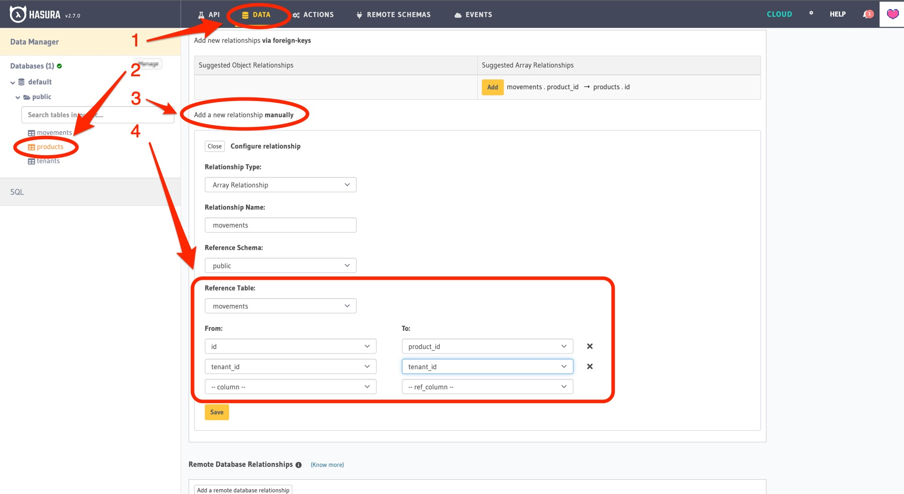

Once you have saved, you can go back to that [Insert Nested Data](#insert-nested-data) Mutation and remove the duplicated `tenant_id` from the movements rows.

---

## Data Aggregation & Views

In our simple schema, the availability of any given product must be calculated by summing all the related movement records.

Such a request can be achieved via Hasura:

```gql
query getProductsWithAvailability {
  products {
    id
    name
    description
    price
    is_visible
    availability: movements_aggregate {
      aggregate {
        sum {
          amount
        }
      }
    }
    tenant_id
    created_at
    updated_at
  }
}
```

🧐 Besides the sub-optimal output structure, with this solution we can't filter products by availability!

### The Availability Query

We could use plain SQL to perform the very same calculation:

```sql
SELECT "product_id", sum("amount") AS "amount"
FROM "movements"
GROUP BY "product_id"
LIMIT 10;
```

### The Availability View

And the next step is to "save" this query into a PostgreSQL view:

```sql
CREATE VIEW "public"."products_availability_live" AS
SELECT "product_id", sum("amount") AS "amount"
FROM "movements"
GROUP BY "product_id";
```

### PostgreSQL Views & Hasura.io

Views are just like tables in Hasura.

You can _track_ our new view, and you can setup a relationship that goes from the `products` table to the `products_availability_live` view.

1. Go to the "Data" tab
2. Click "Track _products_availability_live_" under "Untracked tables or views"
3. Click on "Products" from the left menu
4. Navigate to the "Relationships" tab
5. Add a manual Object relationship to the `products_availability_live` view

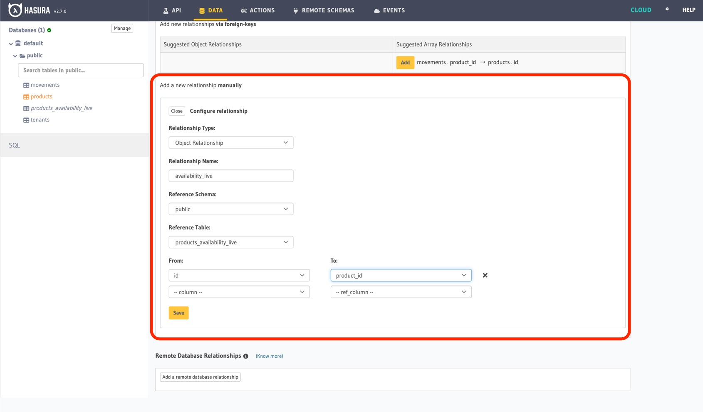

With this new configuration in place, we can go back to the API tab and simplify our query:

```gql
query getProductsWithAvailability {
  products {
    id
    name
    price
    availability: availability_live {
      amount
    }
  }
}
```

Now that we have this relationship in place, we can start to use the `availability.amount` field to sort and filter our dataset:

```gql
query getAvailableProducts {
  products(
    order_by: { availability_live: { amount: asc } }
    where: { availability_live: { amount: { _gt: "0" } } }
  ) {
    id
    name
    price
    availability: availability_live {
      amount
    }
  }
}
```

### Materialized Views

Materialized views store the result of a query in a persisted table instead of sourcing the real data at update time.

🔥 Materialized Views are a Cache Mechanism

For this reason, it is a good idea to add a `timestamp` information to the table, that will be forcefully updated when the view gets refreshed:

```sql
SELECT
  "product_id",
  sum("amount") AS "amount",
  now() AS "updated_at"
FROM "movements"
GROUP BY "product_id"
LIMIT 10;
```

The command to create the materialized view is similar to the one we used for the view:

```sql
CREATE MATERIALIZED VIEW "public"."products_availability_cached" AS
SELECT
  "product_id",
  sum("amount") AS "amount",
  now() AS "updated_at"
FROM "movements"
GROUP BY "product_id";
```

- try to change some availability and see that the "live" view updates while the "cached" view doesn't
- try to add or remove products as well

In order to update a materialized view we must issue a manual command:

```sql
REFRESH MATERIALIZED VIEW "public"."products_availability_cached";
```

👉 Be careful with Materialized Views, they are cool, but occupy much disk space and may end up being quite heavy to refresh!

With Hasura, you can use Materialized Views pretty much the same way you use Views.

### The ProductsDisplay View

We can move a step forward and look into joining data between tables and views, as so to provide a linear data structure that would give us only visible and available products.

The query may be:

```sql
SELECT
  "p"."id",
  "p"."tenant_id",
  "p"."name",
  "p"."description",
  "p"."price",
  "a"."amount",
  "p"."created_at",
  "p"."updated_at"
FROM "products_availability_live" AS "a"
LEFT JOIN "products" AS "p" ON "p"."id" = "a"."product_id"
WHERE "p"."is_visible" IS TRUE
  AND "a"."amount" > 0
LIMIT 10;
```

And the resulting view:

```sql
CREATE VIEW "public"."products_display" AS
SELECT
  "p"."id",
  "p"."tenant_id",
  "p"."name",
  "p"."description",
  "p"."price",
  "a"."amount",
  "p"."created_at",
  "p"."updated_at"
FROM "products_availability_live" AS "a"
LEFT JOIN "products" AS "p" ON "p"."id" = "a"."product_id"
WHERE "p"."is_visible" IS TRUE
  AND "a"."amount" > 0;
```

---

## Test For Performance Issues

The first step for finding bottleneck is to seed TONS of data.

- use the `products` seed query and plant at least 100k products
- use the `movements` seed query and plant at least 500k products

And right away we can start noticing that the following query takes above 1 second to perform:

```gql
query MyQuery {
  products_display(limit: 10) {
    name
    amount
  }
}
```

The reason is that there is great diversity in the `product_id` from line to line.

It would be much easier for the PostgreSQL engine to do the math if all `p1` lines where one after the other, and then `p2`, and so forth.

Luckily, we can fix this with an index:

```sql
CREATE INDEX "movements_product_id_idx"
ON "movements" ("product_id" ASC);
```

> 🔥 Even with indexes, keeping a live inventory for a large amount of products/movements is a **really bad idea!**

---

## Role-based Access Control

Hasura.io handles both vertical and horizontal access control using a combination of `roles` and `session variables`.

- **Horizontal Access Control** restricts access to certain columns
- **Vertical Access Control** restricts access to certain rows

### Access Control Headers

Hasura doesn't provide a login facility. The request must present some credentials in the form of:

- [JWT Token](https://hasura.io/docs/latest/graphql/core/auth/authentication/jwt/)
- [Sidecar Authentication service](https://hasura.io/docs/latest/graphql/core/auth/authentication/webhook/)

The GraphiQL Console provides a simple way to simulate an Authenticated request, by setting some `session variables headers`:

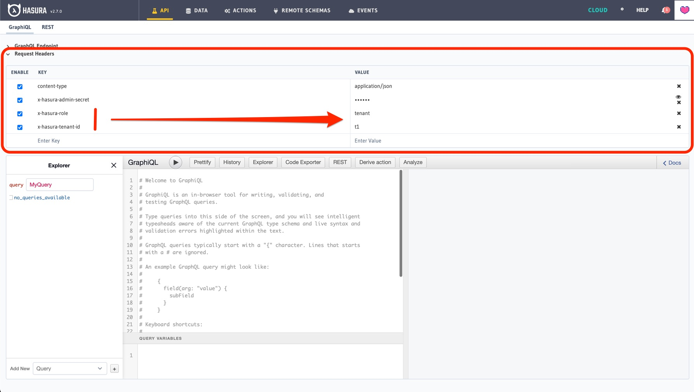

👉 Please note that the _query explorer_ (left side) shows `no_query_available`. That is because we haven't set any ACL rule yet.

### The Tenant Role

The first role that we introduce in our APIs is for the `tenant`:

|  header            | value  |
| ------------------ | ------ |
| x-hasura-role      | tenant |
| x-hasura-tenant-id | t1     |

An request that carries such a role represents a user logged-in to perform some administrative operations over an e-commerce's tenant.

- list his own products
- perform CRUD on products
- perform inventory operations

### Give Tenant Access To Products

1. Go to the "Data" tab
2. Select the "Products" table from the left menu
3. Navigate to the "Permissions" tab

Here we can add the new role `tenant` and setup the ACL rules:

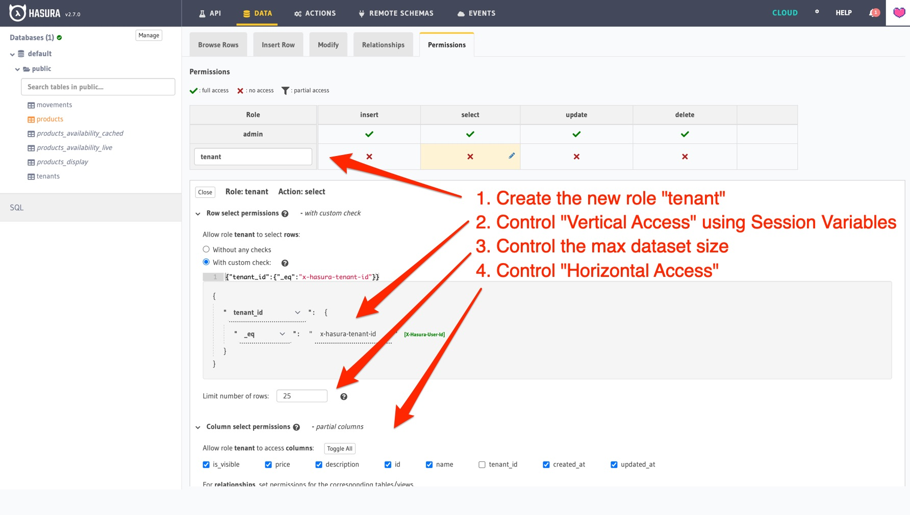

👉 You can setup rather complex rules using the "Row select permission", but the rule of the thumb is that the main tenancy discriminator should available in every table for sake of simplicity and performances.

👉 Always limit the number of rows as so to force offset pagination to the client. You don't want a situation in which the client is allowed to pull millions of rows!


In this screen we can appreciate that the query contains no filter on the tenant.

But the filter is applied under the hood thanks to the Session Variables Headers that are set in the GraphiQL.

🚧 Try to change the `x-hasura-tenant-id` value. What happens?

### Insert Products By Tenant

Now we want to give a Tenant the possibility to insert a product in its own data space.

Here the goal is to avoid cheaters: the `tenant_id` should come from the session, not from the mutation as we did before!

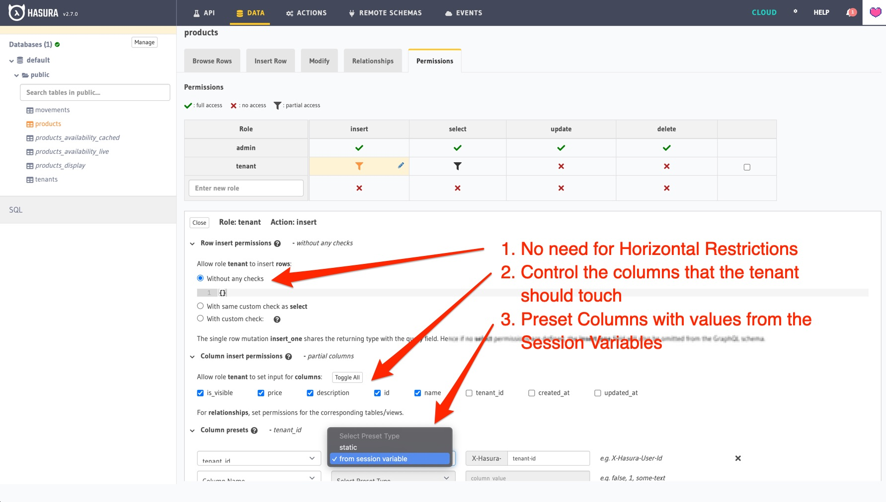

To insert a new product now the Mutation will be something like:

```gql
mutation addProductByTenant {
  insert_products_one(
    object: { id: "pt1", name: "foobar", description: "-", price: 10 }
  ) {
    id
    name
    price
    created_at
  }
}
```

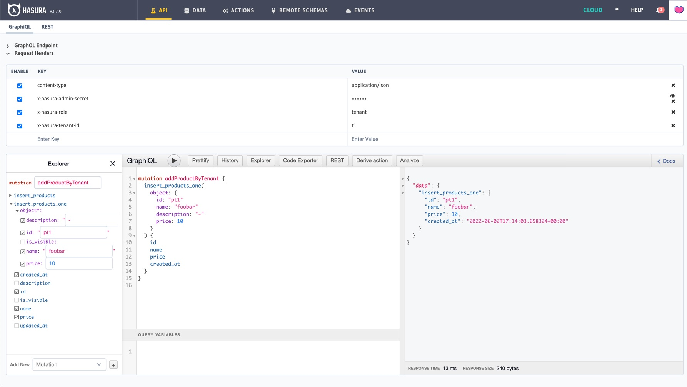

### Update Products By Tenant

Here we combine Horizontal and Vertical Access Control to make sure that only the Products from the acting Tenant can be affected:

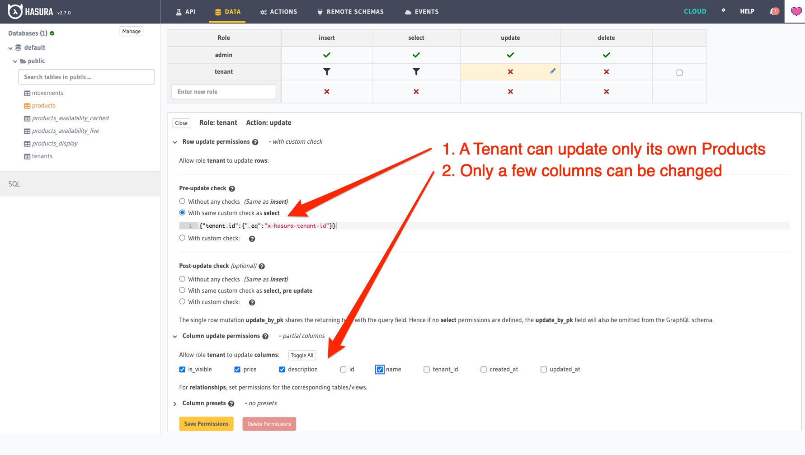

### Delete Products By Tenant

The `delete` permission is usually the easiest for you want to apply Horizontal Access Control only.

Just give the "same as select" rule in the rows restrictions.

### Propagating Permissions

Now yoy should have all the information you need to setup the proper permissions on the `movements` table, but also on the views that we have created.

👉 In fact, _Views_ are often used to improve the granularity of ACL that Hasura can offer, for a View can already be created with a very specific Vertical Control in mind.

---

## Backup & Restore

Now that we have spent a reasonable amount of time playing with the Hasura console, we may start to worry what happens if the server goes down.

Backing things up is never a bad idea.

### Manually Import/Export Metadata

The first approach is to manually export Hasura's metadata, and save such file in a safe place.

When you need it, you can re-import it.

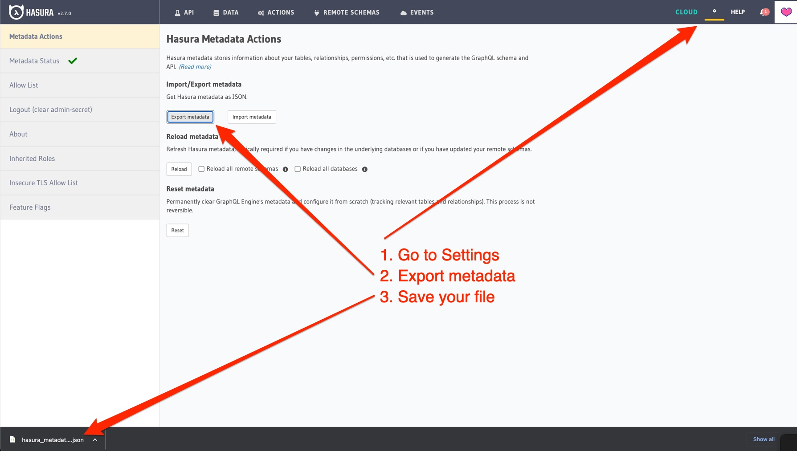

👉 This is a rather simple way for keeping in sync 2 instances, say _development_ and _production_. It's ok to do it like that in the beginning.

### The Hasura CLI

Hasura ships an utility tool that facilitates the management of the service. We are going to use it for:

- manage Hasura's state as code
- manage the Postgre's schema as code
- run a super-charged Hasura console

🔗 [Click here for the official docs.](https://hasura.io/docs/latest/graphql/core/hasura-cli/index/)

### Install Hasura CLI

The following command works on Linux (so GitPod.io) and on a Mac. _Windows users should run it through WSL2._

```bash
curl -L https://github.com/hasura/graphql-engine/raw/stable/cli/get.sh | bash
```

This will yield a new command available on you terminal:

```bash
hasura --help
```

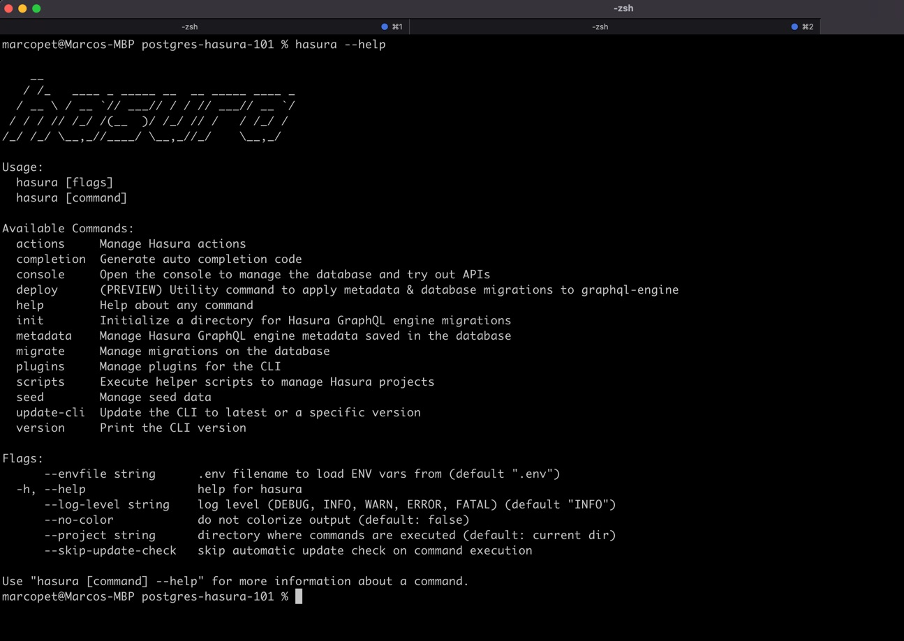

### Initialize Your Codebase From a Running Instance

We have been playing around with Postgres and Hasura for a while now and we definitely don't want to lose all the informations we've build.

> 😅 Just imagine having to redo all those clickings to set up permissions!

Here is the command to run:

```bash
hasura init \
  hasura-ecomm \
  --endpoint http://localhost:8080 \
  --admin-secret hasura
```

`hasura-ecomm` is the name of the folder where we want to collect our state informations. Hasura will create it for you.

👉 This folder name is also **referred as "project"** and we will use it as parameter in the upcoming commands.

The options `endpoint` and `admin-secret` will be saved in a `config.yaml` file inside the

### Hasura Project Structure

Hasura manages its own state using 3 folders:

- migrations
- metadata
- seeds

`migrations` contain versioned SQL instructions the should be able to rebuild the entire Postgres schema from scratch.

Migrations support multiple databases, and they target only the structure of the project.

👉 Migrations don't handle data

`metadata` contains a snapshot of all the rules that you have set up in your Hasura Console. _You should version this files yourself using Git or similar tools_.

`seeds` contains SQL instructions that are meant to reproduce an initial set of contents for your project. Use it for populating static data (list of countries?!?) or to manage development data. Seeds also support multiple databases.

### Export PostgreSQL Schema

HasuraCLI is quite good at taking a full snapshot of all the relevant schema information that you have created in your database:

```bash
hasura migrate create \
  "full-schema" \
  --from-server \
  --database-name default \
  --project hasura-ecomm \
  --endpoint https://your-development-instance.com
```

This command will generate a new migration folder containing only an `up.sql` file that is the SQL source code for all your database schema.

Once done you can check the status of your migrations:

```bash
hasura migrate status \
  --database-name default \
  --project hasura-ecomm \
  --endpoint https://your-development-instance.com
```

👉 It is important to check that your full export is applied as the last available migration, else you may end up into troubles later:

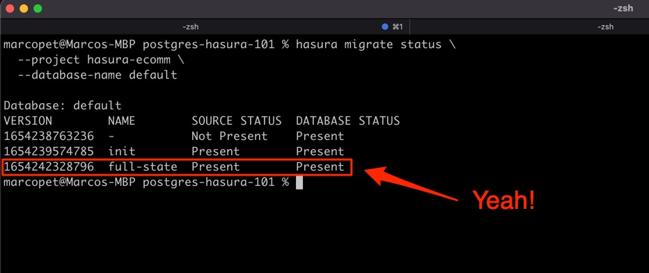

If this is not the case, you probably want to explicitly set this migration as applied:

```bash
hasura migrate apply \
  --version "1654242328796" \
  --skip-execution \
  --database-name default \
  --project hasura-ecomm \
  --endpoint https://your-development-instance.com
```

### Export Hasura Metadata

Every time you operate the Hasura Console and change some rules, you should then export the metatata to your state-as-code project:

```bash
hasura metadata export \
  --project hasura-ecomm \
  --endpoint https://your-development-instance.com
```

👉 I launch my commands from the `postgres-hasura-101` folder, so I must tell HasuraCLI the state folder (or "project") that I want to refer to.

👉 The "project" option makes it easy to manage multiple Hasura projects (or instances) from one single codebase.

👉 When you refer to a project, most of the CLI information are stored in its `config.yaml`, but you can always override those with params such as `--endpoint` or `--admin-secret` as so to target a differe instance (staging? production?) using your local source code. It's a neat way to keep different environments in sync.

### Import PostgreSQL Schema

The following command will attempt to apply all the missing migrations from a local project (data) to a remote Hasura instance (state), for any connected database:

```bash
hasura migrate apply \
  --all-databases \
  --project hasura-ecomm \
  --endpoint https://your-production-instance.com
```

Once done you can check the status of your migrations:

```bash
hasura migrate status \
  --database-name default \
  --project hasura-ecomm \
  --endpoint https://your-production-instance.com
```

👉 The version name of an Hasura Migration is the timestamp that prefixes the full folder name, after that, you can give your migrations a name as well, but that is only intended for human readability only.

### Import Hasura Metadata

The following command will flash the YAML definition of a project to a remote running Hasura instance:

```bash
hasura metadata apply \
  --project hasura-ecomm \
  --endpoint https://your-production-instance.com
```

If you want to be particularly sure, you can also force a full metadata reload to your server:

```bash
hasura metadata reload \
  --project hasura-ecomm \
  --endpoint https://your-production-instance.com
```

### Create a Seed File

HasuraCLI offers a guided procedure for adding seed files to your project:

```bash
hasura seed create \
  "dummy-data" \
  --database-name default \
  --project hasura-ecomm
```

👉 This will use your terminal editor, learn `vi`!

### Seed Data

The last step would be to apply the local seed files to our remote instance:

```bash
hasura seed apply \
  --database-name default \
  --project hasura-ecomm \
  --endpoint https://your-production-instance.com
```

You can also target one speficic seed file with the `--file` flag:

```bash
hasura seed apply \
  --file dummy.sql \
  --database-name default \
  --project hasura-ecomm \
  --endpoint https://your-production-instance.com
```

---

## Customers & Orders

It is now time to approach our business from the Customer's point of view:

- Search through the available products
- Add products to a shopping cart
- Place an order

They seem to be quite straightforward activities but things are often a bit more tricky than what they seem.

### The Availability Issue

Of course, we want to show whether a product is available or not. But the system that we haved designed so far keeps this information in the form of a history of buy/sell documents. An inventory.

Although it is technically doable to create a view that puts together products, tenants, and availability, that solution won't scale when it comes to a shop the size of Amazon.

🚧 We need some form of cache 🚧

But when a Customer want to place an item into the shopping cart, it would be nice to actually provide an updated information and communicate as early as possibile if there is any issue with the cached availability.

We could even take this a step forward, and consider an item that got placed into a shopping cart as "virtually placed", so that information should also affect the real-time availability.

But then a shopping cart should have a timeout else products will be out of stock forever... just because they stay into sleeping shopping carts!

As you can see, it's a damn problem.

### Multi Tenant Order

A Custome should be able to compose an order with Products that come from different Tenants, but when the order is placed, there is the need to generate the proper Inventory Movement documents associated with the Order.

Again, there is logic to be placed around this problem.

### Backend-less Approach

There are many different approaches to the problems that I have listed, and many folks try to solve them with some kind of App written in Java, Node, or AWS Lambdas (if it's serversless is cool, right?)

In this tutorial we will attempt the "backend-less" approach.

👉 We stick to SQL as the Application Layer  
👉 And Hasura as API and Authorization layer

---

## Public Products View

The first step is to create a View that could be used to list and search products for the public:

- it should contain the Product's information
- it should contain the Vendor's information (tenant)
- it should contain the Availability information (calculated)

Luckily, we have already created a _materialized view_ that stores a cached version of the availability: `products_availability_cached`.

### Recursive Materialized Views

We can _JOIN_ this cached table and generate a dataset that is suitable for general public consumption:

```sql
CREATE MATERIALIZED VIEW "products_public_cached" AS
SELECT
  "t"."id" AS "tenant_id",
  "t"."name" AS "tenant_name",
  "p"."id" AS "id",
  "p"."name" AS "name",
  "p"."description" AS "description",
  "p"."price" AS "price",
  COALESCE("a"."amount", 0) AS "availability_amount",
  COALESCE("a"."updated_at", '1970-01-01') AS "availability_updated_at",
  "p"."updated_at" AS "updated_at"

FROM "public"."products" AS "p"
LEFT JOIN "public"."tenants" AS "t" ON "p"."tenant_id" = "t"."id"
LEFT JOIN "public"."products_availability_cached" AS "a" ON "a"."product_id" = "p"."id"

WHERE "p"."is_visible" IS TRUE;
```

There are a few consideration that need to be pointe out:

1. This materialized view relies upon another materialized view, so **the refresh order matters**. It's a progressive cache layer.
2. We are going to duplicate the entire Tenants AND Products table for sake of performances. But keep an eye on disk space.
3. Just having a dedicated table won't suffice. You need also to carefully plan your indexes.

To get a full refresh of this view you will need to:

```sql
REFRESH MATERIALIZED VIEW "products_availability_cached";
REFRESH MATERIALIZED VIEW "products_public_cached";
```

### Refresh Materialized View Concurrently

The big advantage of having one materialized view that relies on another is the way we can refresh them.

Refreshing a materialized view can take long time, and tipically the view is not accessible during this time. This is a bad news for our e-commerce as we want Customers to navigate through it 24/7, with data that is as updated as it can be.

There is a simple trick that can take you a long way into big data.

We can refresh `products_availability_cached` once every couple of hours with a _CRON JOB_ and we don't care much that this is a heavy and blocking operation because nobody directly consumes this view.

Then we can add a _UNIQUE INDEX_ to `products_public_cached`:

```sql
CREATE UNIQUE INDEX "products_public_cached_pk"
ON "products_public_cached" ("product_id", "tenant_id");
```

And with this index in place, we can now refresh this view with the _CONCURRENTLY_ flag:

```sql
REFRESH MATERIALIZED VIEW CONCURRENTLY "products_public_cached";
```

The refresh iteself will take longer time, but the data will be accessibile all through out the refresh process.

Our Customers will be able to get as fresh data as possibile, with a very simple mechanism behind the scene.

### Expose The Public Products View

The first step is to track the newly created view from the "Data -> Default -> Public" page.

Then you can move into the "Permission" tab and setup a new role called "anonymous":

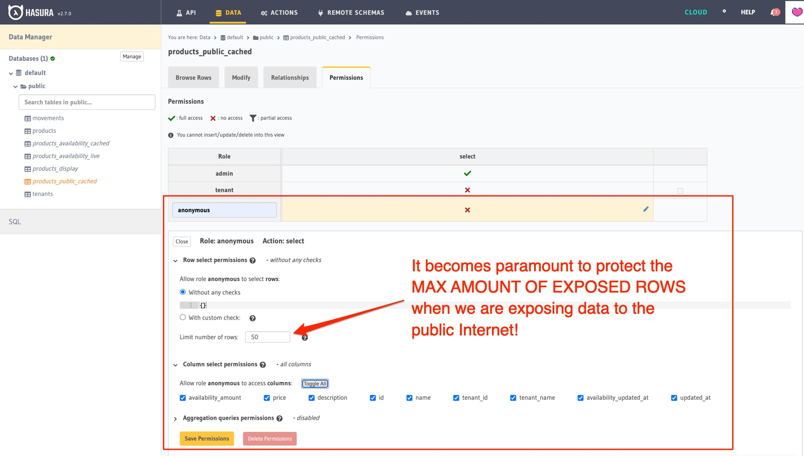

> 👉 You have to [setup the _anonymous_ role](https://hasura.io/docs/latest/graphql/core/auth/authentication/unauthenticated-access/) as configuration to your running instance.

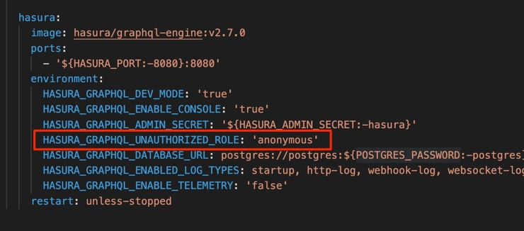

When you have completed those steps, you can move back to your "API" tab, and configure it as so to simulate an anonymous request to your GraphQL API:

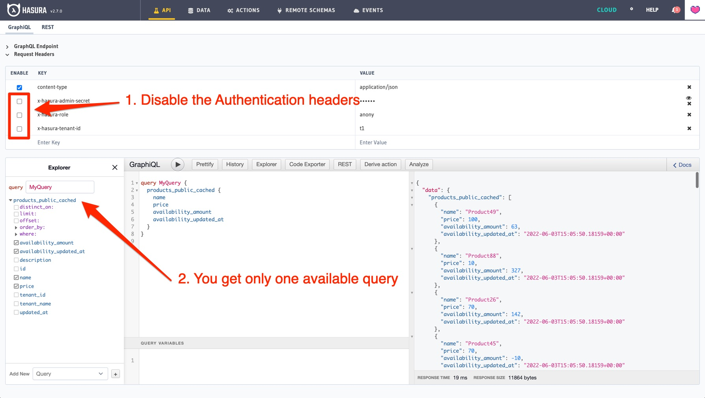

### Derive a REST Endpoint From a GraphQL Query

In this step we are going to turn a GraphQL Query into a public REST endpoint.

First, we need to tune a GraphQL query that returns the data we want to expose:

```gql
query publicProducts {
  products: products_public_cached(order_by: { id: asc }) {
    id
    name
    description
    price
    updated_at
    availability_amount
    availability_updated_at
    tenant_id
    tenant_name
  }
}
```

Once we are satisfied, we can click on the "REST" button to configure a REST endpoint on this query:

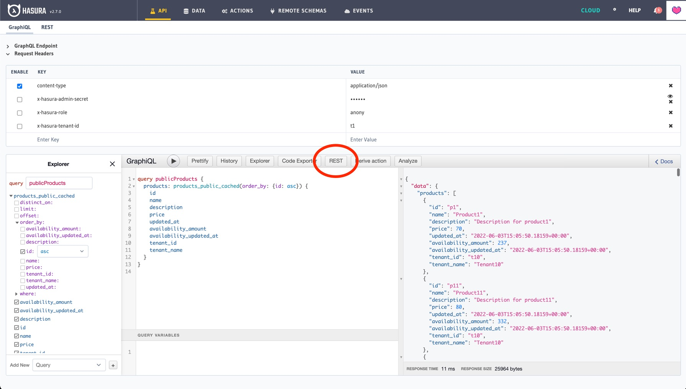

From here, it's just a matter of setting up the endpoint details:

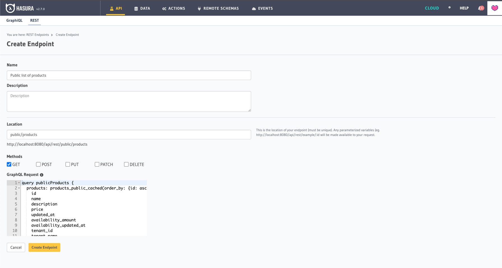

Now you can copy the endpoint's url and test it on any REST compliant client like Chrome or Postman!

### Parametrized REST Endpoint

Of course, the endpoint that we set up will return only the first 25 products, as we set up this limit for the _anonymous_ user in our view's permissions.

So we need to refine this query, as to allow a simple **offset pagination**:

```gql
query publicProducts($offset: Int!) {
  products: products_public_cached(order_by: { id: asc }, offset: $offset) {
    id
    name
    description
    price
    updated_at
    availability_amount
    availability_updated_at
    tenant_id
    tenant_name
  }
}
```

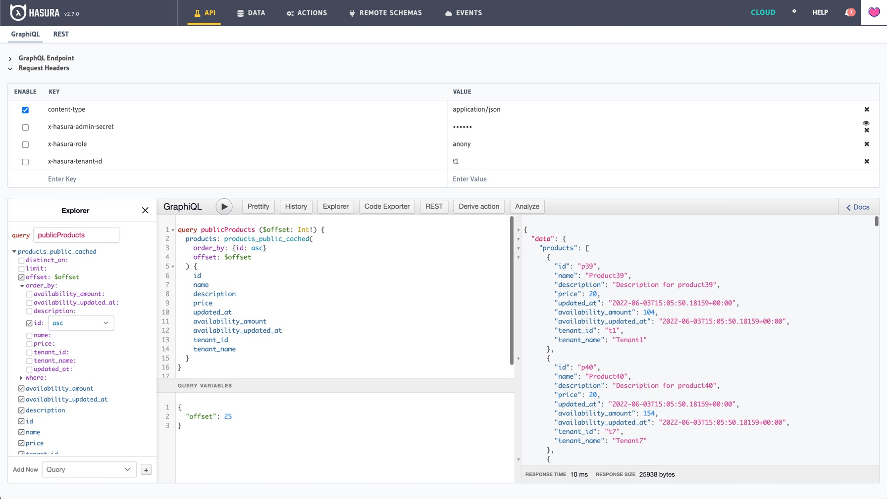

Then, moving into the REST configuration again, we can setup a parametrized endpoint that supports pagination:

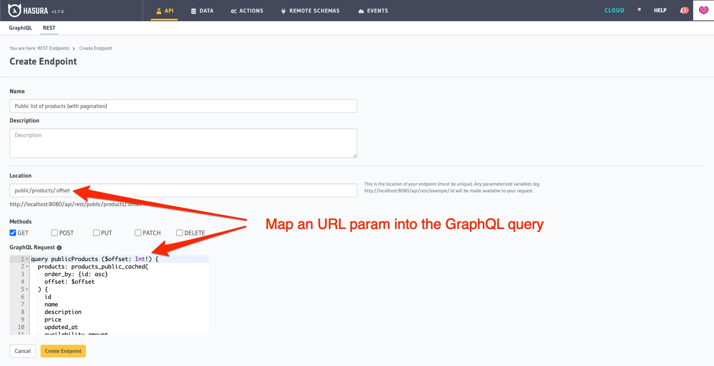

Now I can run the following public requests:

```
http://localhost:8080/api/rest/public/products
http://localhost:8080/api/rest/public/products/25
```

> 👉 It is important to note that the client App must be aware that the pagination is set to 25 items in order to compute the correct offset parameter. Of course, we can provide an endpoint in which both _limit_ and _offset_ are available, as well as an endpoint in which the _lastId_ is provided for implementing a cursor-based pagination.

---

[docker]: https://docker.com
[make]: https://opensource.com/article/18/8/what-how-makefile
[docker-compose]: https://docs.docker.com/compose/
[yaml]: https://en.wikipedia.org/wiki/YAML
[adminer]: https://www.adminer.org/
[hasura]: https://hasura.io/
[graphql]: https://graphql.org/
