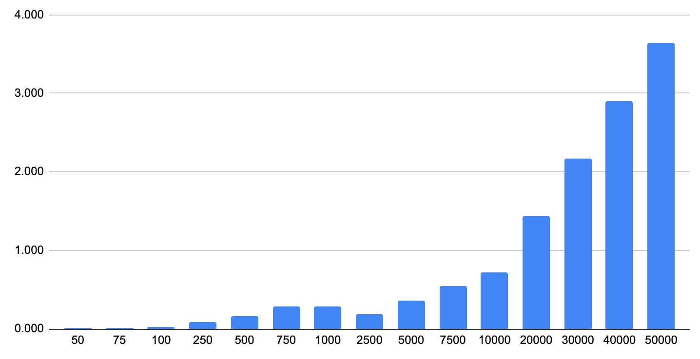

# Select Random Rows in PostgreSQL

There are a few posts on StackOverflow that try to solve the "pick a random row" from a PostgreSQL table.
Here are a few considerations and a few tests around it.

---

## The Dumbest Way

By far, the easies and dumbest way to pick a single random row from a table is by choosing a random `OFFSET` and limit the query to 1 result:

```sql
SELECT * FROM "users_with_ids" 
OFFSET (SELECT floor(random() * 100 + 1))
LIMIT 1;
```

This query will yield a random rows among the first 100. If you tweak the `100` number to match the amount of rows in the table, then you will get an effective random row from the table:

```sql
SELECT * FROM "users_with_ids" 
OFFSET (SELECT floor(random() * (
  SELECT count(*) FROM "users_with_ids"
) + 1))
LIMIT 1;
```

**So why is that the dumbert way?**

Well, there are 2 reasons:

1. You get just 1 row, if you want more, you must re-run the query
2. The performances quickly deteriorates with the size of the table

**bonus reason:** Running `SELECT COUNT(*)` on a big table sucks in performances!

This chart show the execution time of the query in a table of 5 million rows. By incrementing the offset range **the performances deteriorates exponentially**.

[](https://docs.google.com/spreadsheets/d/e/2PACX-1vSnAnSugZhCOFeqEf4U59EW2LfVuMcWFmHcjDQ5ehfVB2zh2X03J0z21RpgZtNpEcEC_Jojji1YjKL8/pubhtml?gid=0&single=true)

**👉 This method is viable ONLY IF:**

1. You have a few thousands lines in the table
2. You are only interested in 1 single row

---

## The Easiest Way

```sql
SELECT * FROM "my_table"
ORDER BY random()
LIMIT 1;
```

## The Smart Way

```sql
SELECT * FROM
  (
    SELECT (0 + trunc(random() * 1000)) AS "user_id"
    FROM generate_series(1, 10000)
    GROUP BY "user_id"
  ) AS "gs1"
JOIN "users_with_ids" USING ("user_id")
LIMIT 1;
```