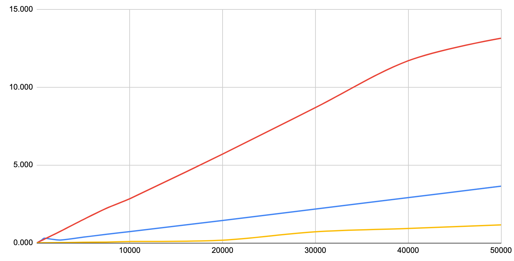
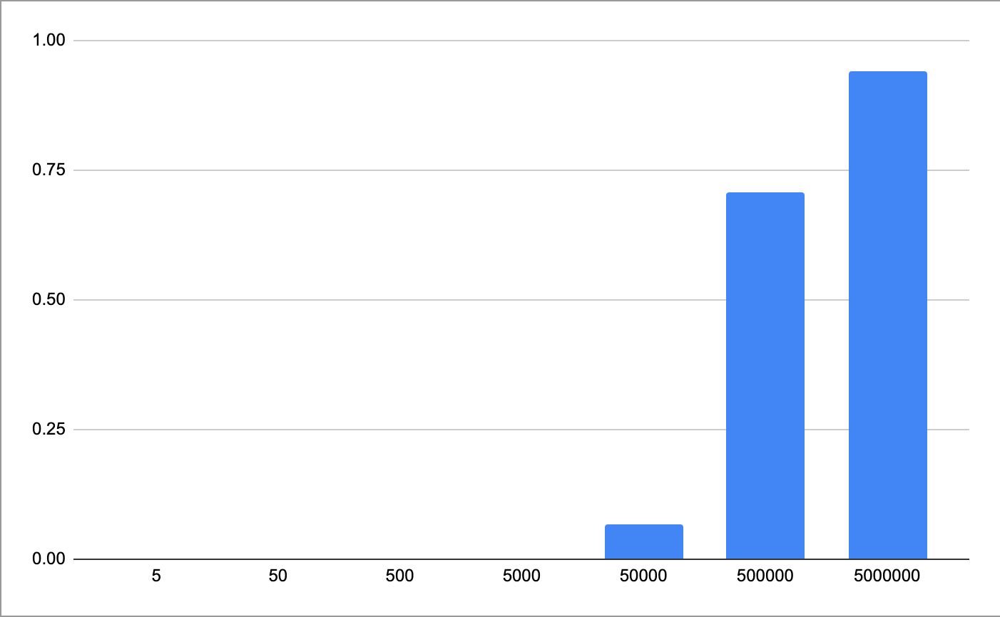
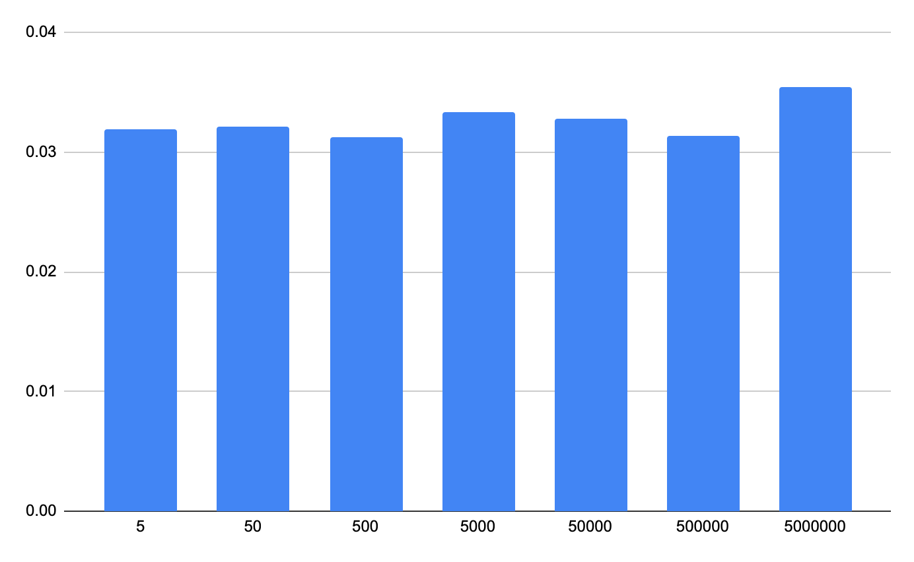

# Select Random Rows in PostgreSQL

There are [a few posts on StackOverflow](https://stackoverflow.com/questions/8674718/best-way-to-select-random-rows-postgresql) that try to solve the **pick a random row from a PostgreSQL table**. 

Out of my research, I've identified 3 main strategies:

- [The Dumbest Way (blue)](#the-dumbest-way)
- [The Easiest Way (red)](#the-easiest-way)
- [The Smart Way (yellow)](#the-smart-way)

Just to spoil the rest of this article, here is the performance chart that I've built by seeding an empty PostgreSQL instance with a frowing number of rows:



On the vertical axis I've mesured the execution time to get 1 random row out of a table. On the horizontal axis I've measured the table's rows count in thousands of rows. It goes from 50k to 50M rows.

Unsurprisingly, **all the methods are equally fast with small datasets**.  
The real difference shows when the data grows.

> 👉 That's why is so desperately important to always [test your schema and queries with massive amount of randomly generated data](../../testing/data-seeding-in-postgresql)!


---

## The Dumbest Way

By far, the easies and dumbest way to pick a single random row from a table is by choosing a random `OFFSET` and limit the query to 1 result:

```sql
SELECT * FROM "users_with_ids" 
OFFSET (SELECT floor(random() * 100 + 1))
LIMIT 1;
```

This query will yield a random rows among the first 100. If you tweak the `100` number to match the amount of rows in the table, then you will get an effective random row from the table:

```sql
SELECT * FROM "users_with_ids" 
OFFSET (SELECT floor(random() * (
  SELECT count(*) FROM "users_with_ids"
) + 1))
LIMIT 1;
```

**So why is that the DUMBEST way?**

Well, there are 2 reasons:

1. you get just 1 row, if you want more, you must re-run the query
2. the performances deteriorates exponentially
3. _(bonus reason) Running `SELECT COUNT(*)` on a big table sucks_

This chart show the execution time of the query in a table of 5 million rows. By incrementing the offset range **the performances deteriorates exponentially**.


[](https://docs.google.com/spreadsheets/d/e/2PACX-1vSnAnSugZhCOFeqEf4U59EW2LfVuMcWFmHcjDQ5ehfVB2zh2X03J0z21RpgZtNpEcEC_Jojji1YjKL8/pubhtml)

**👉 This method is viable ONLY IF:**

1. you have a few thousands lines in the table
2. you are only interested in 1 single row

---

## The Easiest Way

PostgreSQL offers an incredibly simple way to scramble the order of any query's results:

```sql
SELECT * FROM "my_table"
ORDER BY random()
LIMIT 1;
```

This way, you don't only get one random row. You can actually **get any amount of random rows** just by tweaking the `LIMIT` parameter!

> **This is almost too good to be true!**.  
> And you're right my friend.   
> You are right.

Things are not so easy as this method also suffer an exponential decrease in performance with larger tables:

[](https://docs.google.com/spreadsheets/d/e/2PACX-1vSnAnSugZhCOFeqEf4U59EW2LfVuMcWFmHcjDQ5ehfVB2zh2X03J0z21RpgZtNpEcEC_Jojji1YjKL8/pubhtml)

**👉 This method is viable WHEN:**

1. you have a few thousands lines in the table
2. you need more than one random row

---

## The Smart Way

Of course there is a **smart way to select one or more random rows** from a large table. But it comes with some logic and some conditions:

1. The table needs to have a contiguous numeric index (a `SERIAL` field would do great)
2. There should be no gaps (or just few gaps) in such index
3. You need to retrieve a relatively small randomized portion of the entire dataset

> All those conditions are generally met by most tables from which we don't `DELETE` too much. And even so, we could add an additional serial field that we periodically purge by dropping and re-adding it as a batch job.

The following query picks 10 random rows from a table of `9999` rows, which `id` column has a contiguous space `1-9999`.

```sql
SELECT * FROM
  (
    SELECT (0 + trunc(random() * 9999)) AS "id"
    FROM generate_series(1, 100)
    GROUP BY "id"
  ) AS "gs1"
JOIN "my_table" USING ("id")
LIMIT 10;
```

First, we generate a list of random numbers who's value **could be** an existing id in the target table:

```sql
SELECT (0 + trunc(random() * 9999)) AS "id"
FROM generate_series(1, 100)
GROUP BY "id"
```

> 👉 The `GROUP BY` clause will help removing duplicates!

Then we `JOIN` that list with the real data in the table. Any random number that doesn't match with an existing `id` will be automatically removed.

Eventually, we pick our 10 random rows.

**Question: why do we generate 100 random ids, if we only want 10?**  
I'm glad you asked! There are 2 reasons:

1. When we generate random number, we could esily generate duplicates. With the `GROUP BY` clause we make sure those duplicates are removed, but we will end up with less than 100 random numbers, especially when we play with big numbers!
2. When we `JOIN` the random number with the data in the table, we can have some mismatch as well, especially if there are gaps in the `id` column values

All in all, we need to account for **duplicates** and **gaps** so we need to start with a generated list of random number that is greater than the amount of random rows that we want to get.

### When to use this approach?

- big tables

### When NOT to use this approach?

- small tables


[](https://docs.google.com/spreadsheets/d/e/2PACX-1vSnAnSugZhCOFeqEf4U59EW2LfVuMcWFmHcjDQ5ehfVB2zh2X03J0z21RpgZtNpEcEC_Jojji1YjKL8/pubhtml)

https://www.gab.lc/articles/bigdata_postgresql_order_by_random/
https://www.redpill-linpro.com/techblog/2021/05/07/getting-random-rows-faster.html