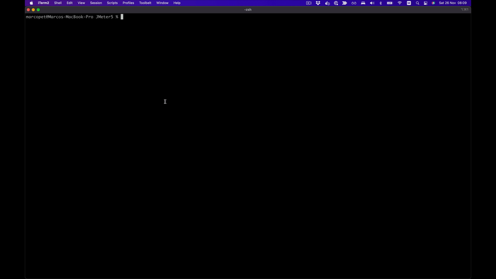
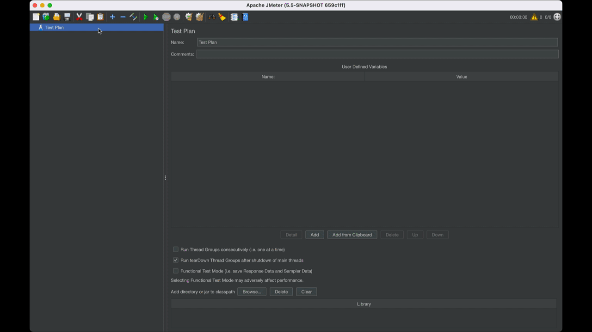
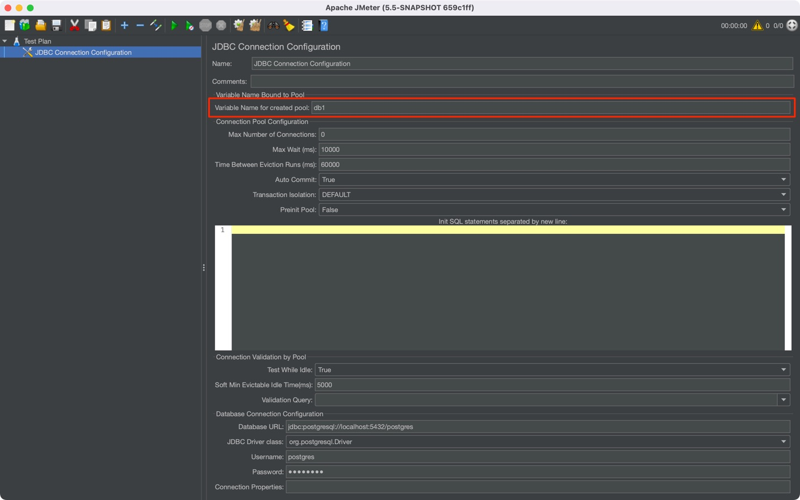
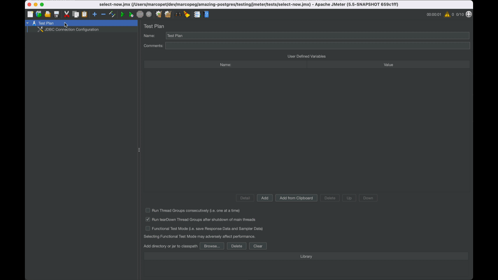

# Run PostgreSQL queries on JMeter
Step by step tutorial and resource collection

---

## Prerequisites

- PostgreSQL running on your machine
- JVM 8+
- JMeter binaries

👉 Scroll down for the detailed instructions how to resolve the prerequisites.

## Setup

I followed this video to get my first examples running:
https://www.youtube.com/watch?v=m1dyGp6qVUo

I used `select now()` as first query, so you don't need any particular data structure ready.

## Resolving Prerequisites

### Install Java on MacOS

Here is a good step-by-step video:
https://www.youtube.com/watch?v=NSvtis2fGlA

Here is how to download Java SDK without Oracle login:
https://gist.github.com/wavezhang/ba8425f24a968ec9b2a8619d7c2d86a6#gistcomment-3019424

In the end, I had to manually setup the `JAVA_HOME` variable:

```bash
export JAVA_HOME=/Library/Java/JavaVirtualMachines/jdk-16.0.2.jdk/Contents/Home
```


### Install JMeter on MacOS

I tried to run `brew install jmeter` and the app works, but there are errors in opening popups as for saving the project or adding configuration (eg. add the *jdbc* drivers *jar* file)

I followed this video:
https://www.youtube.com/watch?v=tPKe6eYnlUk

Here you can download the official last version of JMeter:
https://jmeter.apache.org/download_jmeter.cgi

But here you can download the last working build of it following info from [this thread](https://stackoverflow.com/questions/67615212/why-am-i-not-able-to-click-on-open-icon-in-jmeter):
https://ci-builds.apache.org/job/JMeter/job/JMeter-trunk/lastSuccessfulBuild/artifact/src/dist/build/distributions/

In the end, to make the command globally available, I set up an alias in my `~/.zshrc` file:

```bash
alias jmeter=/Users/xxx/JMeter5/bin/jmeter.sh
```

From now on, you should be able to kick JMeter GUI by running:

```bash
jmeter
```



### Download JDBC Driver:

We are going to test PostgreSQL statements, therefore we must add the Postgres plugin to JMeter.

Here is the link to download the driver:
https://jdbc.postgresql.org/download.html

I then moved the .jar into `/Users/xxx/JMeter5/lib` and linked it directly into my test file.

## Setup JMeter for Postgres

The first thing to do is to add the _JDBC Connection Configuration_:

Move into the _Database Connection Configuration_ panel and use the following parameters to connect to your test db:



- Database URL: `jdbc:postgresql://localhost:5432/postgres`
- JDBC Driver Class: `org.postgresql.Driver`
- Username: `postgres`
- Password: `postgres`

It is also important to **name the JDBC configuration**, we will need it later on:



For my test, I choose the value `db1`.

## Test on SQL Queries

We are now ready to test our first SQL statement:

```sql
SELECT NOW();
```

In order to do that, we need to:

1. Add a _Thread Group_
  - set the _Number of Threads_
  - set the _Loop Count_
2. Add a _JDBC Sampler_ with our query
  - set the _JDBC Connection name_
  - write the query you want to test
3. Add a _Summary Report_ sampler to collect the test 
result
4. Run the test



## Test via CLI

Once you are happy with your test scenario, save it to a file as so to be able to perform the test via CLI:

```bash
jmeter -n \
  -t tests/select-now.jmx \
  -l results/select-now.csv \
  -j results/select-now.log
```
